# vLLM 0.23.0 KV Cache 源码学习手册

> branch_name: 0.23.0
> source_baseline: `0fc695fc6d1d82e9a5ac6835ac8e4e1c83703665` (`v0.23.0`)

本文基于当前 `0.23.0` 源码重新编写，作为 KV Cache 代码走读手册。它不复制
`0.22.1` 文档内容。

## 阅读路线图

这篇文档可以按三轮读，不建议第一遍就把所有分支都读完：

```text
第一轮：只走主链
  1. 核心概念
  2. KV Cache 组件部署形态
  3. 启动阶段：KV cache 如何初始化
  4. Scheduler 创建 KVCacheManager
  5. EngineCore.step() 主链
  6/7. Scheduler.schedule()
  9. allocate_slots()
  11. Worker 侧执行
  12. Scheduler.update_from_output()

第二轮：补 prefix caching 和 block 生命周期
  8. get_computed_blocks()
  9. allocate_slots() 里的 create/cache/coordinator
  10. free() 与 common prefix
  实验二：Prefix Cache 命中

第三轮：看高级路径
  13. DeepSeek V4 KV Cache 专题
  14. Speculative Decoding 与 Lookahead KV
  15. KV Transfer、P/D 分离与 Mooncake
  实验四/五
```

如果你的目标是“能读懂一次请求如何占用 KV blocks”，最短路径是：

```text
Request.update_block_hashes
  -> Scheduler.schedule
  -> KVCacheManager.get_computed_blocks
  -> KVCacheManager.allocate_slots
  -> GPUModelRunner.add_requests / update_requests
  -> BlockTables.append_block_ids
  -> prepare_attn / slot_mapping
```

## 1. 核心概念

### block_size

`block_size` 是 KV cache 管理的逻辑页大小，单位是 token。比如
`block_size = 16` 表示一个 block 能容纳 16 个 token 的 K/V。

一个 token 的 KV 物理大小不是固定常数，取决于：

```text
num_kv_layers
  * num_kv_heads
  * head_size
  * 2   # key + value
  * dtype_size
```

如果有 hybrid KV、sliding window、Mamba、DCP/PCP 或不同 KV cache group，
实际布局还会继续分组。

### hash_block_size

`hash_block_size` 是 prefix caching 计算 block hash 的 token 粒度，不一定等于
物理 KV block 的 `block_size`。

定义在：
[`cache.py#L55`](../../../vllm/config/cache.py#L55)
到 [`cache.py#L65`](../../../vllm/config/cache.py#L65)。

为什么需要单独存在：

```text
物理 block_size
  由不同 KV cache group / attention backend / DeepSeek V4 / Mamba 等决定。

hash_block_size
  由 prefix caching 希望采用的最细共同 hash 粒度决定。
```

当不同 KV cache group 的物理 block size 不同，`hash_block_size` 可以选更细粒度；
后续 `BlockPool.cache_full_blocks()` 会在必要时用
`BlockHashListWithBlockSize` 把细粒度 hash 合并成物理 block 粒度：
[`block_pool.py#L250`](../../../vllm/v1/core/block_pool.py#L250)
到 [`block_pool.py#L260`](../../../vllm/v1/core/block_pool.py#L260)。

### max_model_len

`max_model_len` 表示单条序列最大长度，包括 prompt token 和生成 token。
Scheduler 和 KVCacheManager 会用它限制 admission、block 分配和 cache hit
范围。

### num_gpu_blocks

`num_gpu_blocks` 是 profile 可用显存后得到的 GPU KV block 数。它不是 CLI 里
简单静态写死的值，而是 `_initialize_kv_caches()` 计算后写回
`vllm_config.cache_config.num_gpu_blocks`。

写回位置：
[`core.py#L279`](../../../vllm/v1/engine/core.py#L279)
到 [`core.py#L285`](../../../vllm/v1/engine/core.py#L285)。

### kv_cache_groups

`kv_cache_groups` 表示 Scheduler 侧需要管理的一组 KV cache group。普通
transformer 通常比较直观；hybrid 模型可能有 full attention、sliding window、
Mamba 等不同 group。

Scheduler 创建时会把 `kv_cache_config` 传给
[`Scheduler.__init__()`](../../../vllm/v1/core/sched/scheduler.py#L65)。

### KVCacheGroup / KVCacheGroupSpec / KVCacheSpec

这三个名字最容易混淆。先说结论：在 `0.23.0` 源码里，严格的数据结构名是
`KVCacheGroupSpec` 和 `KVCacheSpec`；通常口头说的 `KVCacheGroup`，多数时候是指
`KVCacheConfig.kv_cache_groups` 列表里的一个 group，也就是一个
`KVCacheGroupSpec`。

```text
KVCacheSpec
  描述单个 layer 或一类 layer 的 KV cache 形态。
  例如 FullAttentionSpec / SlidingWindowSpec / MLAAttentionSpec / MambaSpec。

KVCacheGroupSpec
  把一批 layer_names 和一个 kv_cache_spec 绑定成一个 scheduler/cache group。
  这些 layers 共享同一套 block table 管理粒度。

kv_cache_groups
  KVCacheConfig 里的 list[KVCacheGroupSpec]。
  Scheduler、KVCacheManager、BlockTables 都会按这个列表建立 group 视图。
```

定义位置：

- [`KVCacheSpec`](../../../vllm/v1/kv_cache_interface.py#L95)
- [`KVCacheGroupSpec`](../../../vllm/v1/kv_cache_interface.py#L839)
- [`KVCacheConfig.kv_cache_groups`](../../../vllm/v1/kv_cache_interface.py#L864)

它们的关系可以画成：

```text
KVCacheConfig
  num_blocks
  kv_cache_tensors
  kv_cache_groups: [
    KVCacheGroupSpec(
      layer_names=["model.layers.0.self_attn", "model.layers.1.self_attn", ...],
      kv_cache_spec=FullAttentionSpec(...)
    ),
    KVCacheGroupSpec(
      layer_names=["...swa_cache", "...compressor.state_cache", ...],
      kv_cache_spec=SlidingWindowMLASpec(...) 或 UniformTypeKVCacheSpecs(...)
    )
  ]
```

一个更直观的区分：

| 名称 | 粒度 | 回答的问题 |
| --- | --- | --- |
| `KVCacheSpec` | layer/cache 类型级别 | “这一类 KV cache 每个 block 长什么样、占多少 bytes？” |
| `KVCacheGroupSpec` | group 级别 | “哪些 layers 放在同一个 KV cache 管理组里，使用哪种 spec？” |
| `kv_cache_groups` | config 级别 | “整个模型一共有多少个 KV cache 管理组？” |

`UniformTypeKVCacheSpecs` 是一个特殊的 `KVCacheSpec`：

[`UniformTypeKVCacheSpecs`](../../../vllm/v1/kv_cache_interface.py#L721)
到 [`kv_cache_interface.py#L780`](../../../vllm/v1/kv_cache_interface.py#L780)。

它本身仍然是 `KVCacheSpec`，但内部包着 `dict[layer_name, KVCacheSpec]`。它用于
“多个 layer 类型一致、可以作为一个 group 管理，但每个 layer 仍保留自己的 spec”
的场景。DeepSeek V4 中会经常遇到这种包装。

### KVCacheSpec 与 page_size_bytes

`KVCacheSpec` 描述某一类 layer 的 KV cache 格式。它是“模型需要什么 KV cache”
的规格来源。

基类定义：
[`kv_cache_interface.py#L95`](../../../vllm/v1/kv_cache_interface.py#L95)
到 [`kv_cache_interface.py#L130`](../../../vllm/v1/kv_cache_interface.py#L130)。

最核心字段/属性：

| 名称 | 含义 |
| --- | --- |
| `block_size` | 一个逻辑/物理 page 覆盖多少 token。 |
| `page_size_bytes` | 一个 page/block 需要多少 bytes。 |
| `storage_block_size` | 实际存储粒度；MLA 压缩场景可能小于 `block_size`。 |
| `max_memory_usage_bytes()` | 按最大序列长度估算该 spec 最多占多少 KV memory。 |

普通 attention 的 `page_size_bytes` 由 `AttentionSpec` 计算：
[`kv_cache_interface.py#L159`](../../../vllm/v1/kv_cache_interface.py#L159)
到 [`kv_cache_interface.py#L200`](../../../vllm/v1/kv_cache_interface.py#L200)。

常见公式近似是：

```text
2 * block_size * num_kv_heads * head_size * dtype_size
```

但 DeepSeek V4 MLA、NVFP4、per-token-head scales、Mamba 等都会改写这个公式。

MLA 的 `storage_block_size` 会考虑 `compress_ratio`：
[`kv_cache_interface.py#L352`](../../../vllm/v1/kv_cache_interface.py#L352)
到 [`kv_cache_interface.py#L380`](../../../vllm/v1/kv_cache_interface.py#L380)。

SlidingWindow MLA 也有自己的 page size 逻辑：
[`kv_cache_interface.py#L531`](../../../vllm/v1/kv_cache_interface.py#L531)
到 [`kv_cache_interface.py#L560`](../../../vllm/v1/kv_cache_interface.py#L560)。

### KVCacheTensor

`KVCacheTensor` 是 worker 侧“应该创建哪些真实 KV cache tensors”的描述。
它不是 Scheduler 侧的 block 元信息，而是 `KVCacheConfig` 里交给 worker/model
runner 用来分配 GPU tensor 的计划。

定义在：
[`kv_cache_interface.py#L830`](../../../vllm/v1/kv_cache_interface.py#L830)。

它只有两个核心字段：

| 字段 | 含义 |
| --- | --- |
| `size` | 这个 KV cache tensor 需要多少 bytes。 |
| `shared_by` | 哪些 layer 共享这个 tensor。 |

`KVCacheConfig` 会同时携带两类信息：

```text
kv_cache_tensors
  worker 侧用来分配真实 GPU tensors

kv_cache_groups
  scheduler / block table 侧用来分组管理 block ids
```

定义位置：
[`kv_cache_interface.py#L855`](../../../vllm/v1/kv_cache_interface.py#L855)
到 [`kv_cache_interface.py#L864`](../../../vllm/v1/kv_cache_interface.py#L864)。

生成 `KVCacheTensor` 的典型位置在 `get_kv_cache_configs()` 内部。例如 DeepSeek V4
会按 `(slot_idx, page_size)` 规划 tensor：

[`kv_cache_utils.py#L1225`](../../../vllm/v1/core/kv_cache_utils.py#L1225)
到 [`kv_cache_utils.py#L1244`](../../../vllm/v1/core/kv_cache_utils.py#L1244)。

worker 侧真正消费它的位置是 `init_kv_cache()`：

[`attn_utils.py#L343`](../../../vllm/v1/worker/gpu/attn_utils.py#L343)
到 [`attn_utils.py#L360`](../../../vllm/v1/worker/gpu/attn_utils.py#L360)。

这里会按 `kv_cache_tensors` 分配 raw tensors，然后 reshape 成各 attention backend
需要的结构，并绑定到 `static_forward_context` 和 `runner_kv_caches`。

一句话区分：

```text
KVCacheTensor
  描述 worker 要分配的真实 tensor 容量和共享关系。

KVCacheBlock
  描述 Scheduler 管理的物理 block 元信息和 prefix cache hash。

BlockTables
  描述 request 当前使用哪些 block ids。
```

### KVCacheBlock 与 KVCacheBlocks

`KVCacheBlock` 可以理解为一个物理 KV block 的元信息；`KVCacheBlocks` 是按
cache group 组织的一批 block。请求命中 prefix cache 时，通常是把已有物理
blocks 绑定到请求，而不是重新创建物理 KV 内容。

### BlockPool

`BlockPool` 管理 Scheduler 侧所有 `KVCacheBlock`。它不是 GPU tensor 本身，而是
“哪些 block 空闲、哪些 block 被请求引用、哪些 block 已进入 prefix cache”的
元信息池。

定义入口：
[`block_pool.py#L130`](../../../vllm/v1/core/block_pool.py#L130)
到 [`block_pool.py#L171`](../../../vllm/v1/core/block_pool.py#L171)。

核心内部结构：

| 字段 | 含义 |
| --- | --- |
| `blocks` | 所有 `KVCacheBlock` 元信息对象。 |
| `free_block_queue` | 可分配 block 队列，也承载可驱逐 cached block。 |
| `cached_block_hash_to_block` | prefix cache hash 到 cached blocks 的映射。 |
| `null_block` | 占位 block，常用于 sliding window / sparse 场景。 |

### block_table 与 slot_mapping

`block_table` 和 `slot_mapping` 都在 worker 侧，但语义不同。

`BlockTables` 定义：
[`block_table.py#L12`](../../../vllm/v1/worker/gpu/block_table.py#L12)
到 [`block_table.py#L68`](../../../vllm/v1/worker/gpu/block_table.py#L68)。

| 名称 | 含义 |
| --- | --- |
| `block_table` | request 当前拥有的物理 block ids。attention 读历史 KV 时查它。 |
| `slot_mapping` | 当前 step 的 token 应该写到哪个 KV 物理 slot。attention 写新 KV 时用它。 |

普通 `CP_SIZE == 1` 时，slot id 计算是：

```text
block_index = position // block_size
block_offset = position % block_size
block_number = block_table[request, block_index]
slot_id = block_number * block_size + block_offset
```

对应 kernel：
[`block_table.py#L224`](../../../vllm/v1/worker/gpu/block_table.py#L224)
到 [`block_table.py#L284`](../../../vllm/v1/worker/gpu/block_table.py#L284)。

### 核心 CacheConfig 配置速查

这些配置直接影响 KV cache 容量、布局或 prefix caching 行为：

| 配置 | 位置 | 作用 |
| --- | --- | --- |
| `block_size` | [`cache.py#L48`](../../../vllm/config/cache.py#L48) | 默认物理 block token 数，后续可能被 backend/hybrid 修正。 |
| `hash_block_size` | [`cache.py#L55`](../../../vllm/config/cache.py#L55) | prefix hash 粒度，可细于物理 block。 |
| `gpu_memory_utilization` | [`cache.py#L67`](../../../vllm/config/cache.py#L67) | profile 时给 KV cache 留多少 GPU memory。 |
| `cache_dtype` | [`cache.py#L75`](../../../vllm/config/cache.py#L75) | KV cache 存储 dtype，例如 `auto`、fp8、`fp8_ds_mla`。 |
| `num_gpu_blocks_override` | [`cache.py#L87`](../../../vllm/config/cache.py#L87) | 手动覆盖 profiled GPU block 数，常用于测试抢占。 |
| `enable_prefix_caching` | [`cache.py#L92`](../../../vllm/config/cache.py#L92) | 是否启用 prefix cache。 |
| `prefix_caching_hash_algo` | [`cache.py#L94`](../../../vllm/config/cache.py#L94) | block hash 算法，影响 prefix cache key。 |
| `kv_cache_dtype_skip_layers` | [`cache.py#L115`](../../../vllm/config/cache.py#L115) | 指定跳过 KV cache quantization 的 layer/attention type。 |
| `mamba_block_size` | [`cache.py#L121`](../../../vllm/config/cache.py#L121) | Mamba cache 的 block 粒度。 |
| `mamba_cache_mode` | [`cache.py#L136`](../../../vllm/config/cache.py#L136) | Mamba state 如何参与 cache。 |
| `kv_cache_memory_bytes` | [`cache.py#L159`](../../../vllm/config/cache.py#L159) | 手动指定每 GPU KV cache memory，设置后忽略 `gpu_memory_utilization`。 |
| `kv_offloading_size` | [`cache.py#L169`](../../../vllm/config/cache.py#L169) | 启用 CPU KV offloading 的 buffer 大小。 |
| `kv_offloading_backend` | [`cache.py#L176`](../../../vllm/config/cache.py#L176) | KV offloading backend，例如 `native` / `lmcache`。 |

## 2. KV Cache 组件部署形态

一个常见误解是：有多个 `kv_cache_groups`，是不是就会有多个 Scheduler 或多个
KVCacheManager？答案是：**单个 EngineCore 内通常只有一个 Scheduler 和一个
KVCacheManager**。多个 `kv_cache_groups` 是同一个 KVCacheManager 内部的 group
维度。

可以先用下面这张图建立全局视角：左侧是请求入口和 EngineCore 所在进程，中间是
Scheduler 侧的 KV 元数据管理，右侧是 worker/model runner 进程里真正落在 GPU
上的 KV tensors。

```mermaid
flowchart LR
  subgraph Frontend["API Server / Frontend Process"]
    Req["EngineCoreRequest<br/>add_request / abort / step control"]
  end

  subgraph CoreProc["EngineCore Process<br/>one stack per DP rank"]
    InputThread["Input IO Thread<br/>process_input_sockets"]
    MainThread["Main EngineCore Thread<br/>run_busy_loop / step"]
    EngineCoreNode["EngineCore<br/>1 instance"]
    SchedulerNode["Scheduler<br/>1 per EngineCore"]
    KVManager["KVCacheManager<br/>1 per Scheduler"]
    Coordinator["KVCacheCoordinator<br/>1 per KVCacheManager"]
    Groups["KVCacheConfig.kv_cache_groups<br/>group 0..G-1"]
    BlockPool["BlockPool<br/>KVCacheBlock metadata<br/>free / cached / ref_cnt"]
    KVBlocks["KVCacheBlocks<br/>group -> physical block ids"]
    SchedOut["SchedulerOutput<br/>scheduled requests + new block ids"]
  end

  subgraph WorkerProc["Worker Process(es)<br/>MultiprocExecutor / UniProcExecutor"]
    WorkerLoop["Worker loop<br/>worker_busy_loop or in-process call"]
    GPUWorker["GPUWorker"]
    Runner["GPUModelRunner<br/>model execution owner"]
    BlockTables["BlockTables<br/>1 object with per-group tables"]
    TableRows["block_tables[group_id]<br/>request row + logical block -> physical block"]
    SlotMapping["slot_mappings[group_id]<br/>token position -> physical KV slot"]
    KVTensors["GPU KV tensors<br/>kv_cache_tensors / self.kv_caches"]
    AttnBackend["Attention backend<br/>read old KV / write new KV"]
  end

  Req --> InputThread --> MainThread --> EngineCoreNode --> SchedulerNode
  SchedulerNode -- "schedule token budget" --> KVManager
  Groups -. "shared group axis" .-> KVManager
  KVManager --> Coordinator --> BlockPool --> KVBlocks --> SchedOut
  SchedOut -- "Executor.execute_model" --> WorkerLoop --> GPUWorker --> Runner
  Runner -- "add_requests / update_requests" --> BlockTables
  BlockTables --> TableRows --> AttnBackend
  BlockTables --> SlotMapping --> AttnBackend
  KVTensors --> AttnBackend
  AttnBackend --> KVTensors
```



读这张图时要注意三层边界：

- **进程/线程边界**：API server 把请求送到 EngineCore；EngineCore 有输入 IO
  线程和主循环线程；Multiproc 场景下 worker/model runner 在独立 worker 进程里。
- **逻辑管理边界**：`Scheduler -> KVCacheManager -> KVCacheCoordinator ->
  BlockPool` 管的是 block 元信息、block id、prefix cache 命中和引用计数。
- **物理数据边界**：真正的 K/V tensor 在 worker 侧 GPU memory 中；
  `BlockTables` 和 `slot_mapping` 把 Scheduler 分配的物理 block id 翻译成 attention
  kernel 能读写的位置。

单个 EngineCore 内的实例关系：

```text
EngineCore
  -> self.scheduler = Scheduler(...)
       -> self.kv_cache_manager = KVCacheManager(...)
            -> self.coordinator = get_kv_cache_coordinator(...)
                 -> single_type_managers / block_pool / per-group views
```

源码入口：

- `EngineCore.__init__()` 创建一个 Scheduler：
  [`core.py#L149`](../../../vllm/v1/engine/core.py#L149)
  到 [`core.py#L157`](../../../vllm/v1/engine/core.py#L157)。
- `Scheduler.__init__()` 创建一个 KVCacheManager：
  [`scheduler.py#L148`](../../../vllm/v1/core/sched/scheduler.py#L148)
  到 [`scheduler.py#L151`](../../../vllm/v1/core/sched/scheduler.py#L151)。
- `KVCacheManager.__init__()` 创建 coordinator：
  [`kv_cache_manager.py#L142`](../../../vllm/v1/core/kv_cache_manager.py#L142)
  到 [`kv_cache_manager.py#L154`](../../../vllm/v1/core/kv_cache_manager.py#L154)。

因此，`kv_cache_groups` 不是“实例数量”的维度，而是“管理坐标轴”的维度：

```text
kv_cache_config.kv_cache_groups = [group0, group1, group2]

同一个 Scheduler
  -> 调度 request 时携带每个 group 的 block ids

同一个 KVCacheManager
  -> 按 group 计算/分配/释放 KVCacheBlocks

同一个 GPUModelRunner.BlockTables
  -> 为每个 group 建一张 worker 侧 block table
```

三者的粒度可以这样对齐：

| 组件 | 实例数量 | group 粒度含义 |
| --- | --- | --- |
| `Scheduler` | 单 EngineCore 内 1 个 | request 调度时要同时考虑所有 KV groups。 |
| `KVCacheManager` | 单 Scheduler 内 1 个 | 返回的 `KVCacheBlocks` 按 group 组织。 |
| `KVCacheCoordinator` | 单 KVCacheManager 内 1 个 | 内部可有多个 single-type manager 处理不同 group/type。 |
| `BlockPool` | coordinator 内部共享/管理 | 管理物理 `KVCacheBlock` 元信息和 prefix cache hash。 |
| `BlockTables` | 单 worker/model runner 内 1 个对象 | 内部按 group 建多张 block table。 |

如果是 data parallel 多 EngineCore，则是另一层部署形态：

```text
DP size = N
  -> N 个 EngineCore
  -> N 个 Scheduler
  -> N 个 KVCacheManager
  -> 每个 EngineCore 管自己的本地 KV cache blocks
```

也就是说：

```text
单 EngineCore 内：
  多 group，共用一套 Scheduler/KVCacheManager。

多 EngineCore / DP：
  每个 EngineCore 各有一套 Scheduler/KVCacheManager。
```

## 3. 启动阶段：KV cache 如何初始化

主线：

```text
EngineCore.__init__
  -> self.model_executor = executor_class(vllm_config)
  -> _initialize_kv_caches()
  -> model_executor.initialize_from_config()
```

### EngineCore.__init__()

[`EngineCore.__init__()`](../../../vllm/v1/engine/core.py#L98)
先创建 executor，再初始化 KV cache：

- executor 创建：
  [`core.py#L121`](../../../vllm/v1/engine/core.py#L121)
  到 [`core.py#L124`](../../../vllm/v1/engine/core.py#L124)。
- KV cache 初始化：
  [`core.py#L131`](../../../vllm/v1/engine/core.py#L131)
  到 [`core.py#L132`](../../../vllm/v1/engine/core.py#L132)。

### _initialize_kv_caches()

[`EngineCore._initialize_kv_caches()`](../../../vllm/v1/engine/core.py#L236)
分成几个阶段：

1. 注册 KV cache specs：
   [`core.py#L239`](../../../vllm/v1/engine/core.py#L239)
   到 [`core.py#L240`](../../../vllm/v1/engine/core.py#L240)。
2. 从 executor 获取模型所需 KV cache specs：
   [`core.py#L242`](../../../vllm/v1/engine/core.py#L242)
   到 [`core.py#L244`](../../../vllm/v1/engine/core.py#L244)。
3. profile 可用于 KV cache 的 GPU memory：
   [`core.py#L255`](../../../vllm/v1/engine/core.py#L255)
   到 [`core.py#L258`](../../../vllm/v1/engine/core.py#L258)。
4. 根据 specs 和可用显存生成 worker 侧 KV cache configs：
   [`core.py#L268`](../../../vllm/v1/engine/core.py#L268)
   到 [`core.py#L270`](../../../vllm/v1/engine/core.py#L270)。
5. 如果 auto-fit 修改了 `max_model_len`，同步到 workers：
   [`core.py#L272`](../../../vllm/v1/engine/core.py#L272)
   到 [`core.py#L277`](../../../vllm/v1/engine/core.py#L277)。
6. 生成 Scheduler 侧 KV cache config，并写回 `num_gpu_blocks` / `block_size`：
   [`core.py#L279`](../../../vllm/v1/engine/core.py#L279)
   到 [`core.py#L285`](../../../vllm/v1/engine/core.py#L285)。
7. worker 侧真正初始化 KV cache：
   [`core.py#L289`](../../../vllm/v1/engine/core.py#L289)
   到 [`core.py#L290`](../../../vllm/v1/engine/core.py#L290)。

### 初始化阶段变量词典

| 名称 | 所在层 | 含义 |
| --- | --- | --- |
| `KVCacheSpec` | 模型/worker | 某类 KV cache 的规格，例如 block size、每 block bytes、是否 sliding window。 |
| `KVCacheConfig` | worker/scheduler | 根据显存 profile 生成的 KV cache 配置，包含 blocks、groups、tensors。 |
| `KVCacheGroupSpec` | scheduler/worker | 一组共享相似管理规则的 KV cache layers。 |
| `KVCacheTensor` | worker | 实际 KV tensor 的描述，最终会对应 GPU 上的 tensor。 |
| `kv_cache_groups` | scheduler | Scheduler 管理 KV blocks 的分组视图。 |
| `num_blocks` | scheduler/worker | 当前 KV cache config 中可用 block 数。 |
| `block_ids` | scheduler/worker | Scheduler 为某个 request 分配或命中的物理 block id。 |
| `block_table` | worker | request 到 block ids 的二维表，attention 读历史 KV 时使用。 |
| `slot_mapping` | worker | 当前 step 的 token 到 KV 物理 slot 映射，attention 写入新 KV 时使用。 |

源码定义：

- [`KVCacheSpec`](../../../vllm/v1/kv_cache_interface.py#L96)
- [`KVCacheTensor`](../../../vllm/v1/kv_cache_interface.py#L830)
- [`KVCacheGroupSpec`](../../../vllm/v1/kv_cache_interface.py#L840)
- [`KVCacheConfig`](../../../vllm/v1/kv_cache_interface.py#L855)
- [`KVCacheBlock`](../../../vllm/v1/core/kv_cache_utils.py#L117)
- [`KVCacheBlocks`](../../../vllm/v1/core/kv_cache_manager.py#L26)

### `get_kv_cache_configs()` 做什么

[`get_kv_cache_configs()`](../../../vllm/v1/core/kv_cache_utils.py#L1956)
把三类信息合起来：

```text
VllmConfig
  + model_executor.get_kv_cache_specs()
  + model_executor.determine_available_memory()
  -> per-worker KVCacheConfig
```

直觉上，它回答的是：“每个 worker 能创建多少 KV blocks，以及这些 blocks 应该按
什么 KV group/tensor 布局创建。”

### `generate_scheduler_kv_cache_config()` 做什么

[`generate_scheduler_kv_cache_config()`](../../../vllm/v1/core/kv_cache_utils.py#L1698)
从 worker 侧 KV configs 中抽取 Scheduler 需要的统一视图。

Scheduler 不关心每个 GPU tensor 的全部细节，它主要需要：

- `num_blocks`
- `kv_cache_groups`
- 每个 group 的 `kv_cache_spec`
- prefix cache / sliding window / hybrid 管理所需元信息

这也是为什么 `_initialize_kv_caches()` 会在生成 scheduler config 后写回：

```text
vllm_config.cache_config.num_gpu_blocks = scheduler_kv_cache_config.num_blocks
vllm_config.cache_config.block_size = min(group.block_size)
```

代码位置：
[`core.py#L279`](../../../vllm/v1/engine/core.py#L279)
到 [`core.py#L285`](../../../vllm/v1/engine/core.py#L285)。

### `resolve_kv_cache_block_sizes()` 为什么在 Scheduler 前调用

[`resolve_kv_cache_block_sizes()`](../../../vllm/v1/core/kv_cache_utils.py#L593)
在 `EngineCore.__init__()` 里位于 `_initialize_kv_caches()` 之后、
`Scheduler(...)` 之前：

[`core.py#L145`](../../../vllm/v1/engine/core.py#L145)
到 [`core.py#L147`](../../../vllm/v1/engine/core.py#L147)。

它会给 Scheduler 两个粒度：

- `scheduler_block_size`：Scheduler/KVCacheManager 管理 slots 时用的 block size。
- `hash_block_size`：prefix cache 计算 block hash 时用的 block size。

两者大多数情况下相同，但在 hybrid/cache sharing/connector 等场景下需要显式
解析，避免 Scheduler 的分配粒度和 prefix hash 粒度混在一起。

### MultiprocExecutor.initialize_from_config 到 worker

`_initialize_kv_caches()` 的最后一步是：

```text
model_executor.initialize_from_config(kv_cache_configs)
```

在 `MultiprocExecutor` 路径下，它继承自 `Executor.initialize_from_config()`，
本质上是一个 collective RPC：

[`abstract.py#L118`](../../../vllm/v1/executor/abstract.py#L118)
到 [`abstract.py#L126`](../../../vllm/v1/executor/abstract.py#L126)。

调用展开：

```text
Executor.initialize_from_config(kv_cache_configs)
  -> collective_rpc("initialize_from_config", args=(kv_cache_configs,))
     -> MultiprocExecutor.collective_rpc()
        -> rpc_broadcast_mq.enqueue(("initialize_from_config", ...))
        -> WorkerProc.worker_busy_loop()
        -> WorkerWrapperBase.initialize_from_config()
        -> GPUWorker.initialize_from_config()
        -> GPUModelRunner.initialize_kv_cache()
  -> collective_rpc("compile_or_warm_up_model")
     -> worker 侧 warmup / cudagraph capture
```

`MultiprocExecutor.collective_rpc()` 广播 RPC 并等待 response MQ：

[`multiproc_executor.py#L324`](../../../vllm/v1/executor/multiproc_executor.py#L324)
到 [`multiproc_executor.py#L381`](../../../vllm/v1/executor/multiproc_executor.py#L381)。

worker 侧 `WorkerWrapperBase.initialize_from_config()` 会按当前 rpc rank 取对应的
`KVCacheConfig`，再转给实际 worker：

[`worker_base.py#L315`](../../../vllm/v1/worker/worker_base.py#L315)
到 [`worker_base.py#L318`](../../../vllm/v1/worker/worker_base.py#L318)。

### GPUWorker.initialize_from_config()

[`GPUWorker.initialize_from_config()`](../../../vllm/v1/worker/gpu_worker.py#L563)
是真正进入 GPU worker KV 初始化的入口：

```text
GPUWorker.initialize_from_config(kv_cache_config)
  -> cache_config.num_gpu_blocks = kv_cache_config.num_blocks
  -> ensure_kv_transfer_initialized(vllm_config, kv_cache_config)
  -> with memory_pool_context(tag="kv_cache")
       model_runner.initialize_kv_cache(kv_cache_config)
  -> maybe init routed experts capturer
  -> maybe _init_kv_zero_meta()
```

重点源码：

- 写回 worker 本地 `cache_config.num_gpu_blocks`：
  [`gpu_worker.py#L568`](../../../vllm/v1/worker/gpu_worker.py#L568)。
- KV connector 初始化必须在 `initialize_kv_cache()` 前：
  [`gpu_worker.py#L571`](../../../vllm/v1/worker/gpu_worker.py#L571)
  到 [`gpu_worker.py#L577`](../../../vllm/v1/worker/gpu_worker.py#L577)。
- 进入 KV cache memory pool 并调用 model runner：
  [`gpu_worker.py#L579`](../../../vllm/v1/worker/gpu_worker.py#L579)
  到 [`gpu_worker.py#L580`](../../../vllm/v1/worker/gpu_worker.py#L580)。
- 需要 KV zeroing 时初始化 zero metadata：
  [`gpu_worker.py#L588`](../../../vllm/v1/worker/gpu_worker.py#L588)
  到 [`gpu_worker.py#L590`](../../../vllm/v1/worker/gpu_worker.py#L590)。

### GPUModelRunner.initialize_kv_cache()

[`GPUModelRunner.initialize_kv_cache()`](../../../vllm/v1/worker/gpu/model_runner.py#L390)
负责把 `KVCacheConfig` 变成 worker 侧运行时结构：

```text
GPUModelRunner.initialize_kv_cache
  -> deepcopy kv_cache_config，保存到 self.kv_cache_config
  -> 根据 max_model_len / encoder-decoder 修正 block_table_max_model_len
  -> 遍历 kv_cache_groups，计算 block_sizes 和 max_num_blocks_per_group
  -> init_attn_backend()
       得到 attn_groups、kernel_block_sizes、cudagraph 支持情况
  -> 创建 BlockTables
       request -> physical block ids
       current step slot_mappings
  -> 初始化 Mamba/SSM backend
  -> 创建 cudagraph_manager
  -> speculator 绑定 attention / block table
  -> init_kv_cache()
       实际创建 GPU KV cache tensors
       注入 static_forward_context
  -> get_kv_connector(vllm_config, kv_caches_dict)
```

关键源码：

- 计算每个 group 的 block size 和最大 block table 长度：
  [`model_runner.py#L400`](../../../vllm/v1/worker/gpu/model_runner.py#L400)
  到 [`model_runner.py#L425`](../../../vllm/v1/worker/gpu/model_runner.py#L425)。
- 初始化 attention backend：
  [`model_runner.py#L427`](../../../vllm/v1/worker/gpu/model_runner.py#L427)。
- 创建 worker 侧 `BlockTables`：
  [`model_runner.py#L428`](../../../vllm/v1/worker/gpu/model_runner.py#L428)
  到 [`model_runner.py#L438`](../../../vllm/v1/worker/gpu/model_runner.py#L438)。
- 创建 `kv_caches` 列表并调用 `init_kv_cache()`：
  [`model_runner.py#L467`](../../../vllm/v1/worker/gpu/model_runner.py#L467)
  到 [`model_runner.py#L477`](../../../vllm/v1/worker/gpu/model_runner.py#L477)。
- 基于实际 KV tensors 创建 worker 侧 connector：
  [`model_runner.py#L478`](../../../vllm/v1/worker/gpu/model_runner.py#L478)。

这里要区分三种对象：

| 对象 | 所在层 | 作用 |
| --- | --- | --- |
| `KVCacheConfig` | EngineCore/worker 配置 | 描述 KV cache groups、tensors、num_blocks。 |
| `BlockTables` | worker runtime | request 到物理 block ids 的表，attention 读取历史 KV 用。 |
| `self.kv_caches` | worker GPU tensor | 真正存放 K/V 内容的 tensors。 |

所以 `_initialize_kv_caches()` 结束后，Scheduler 侧知道有哪些 blocks 可分配；
worker 侧已经有实际 KV tensors 和 block tables，后续只需要每轮把 block ids
写进 table。

## 4. Scheduler 创建 KVCacheManager

`EngineCore.__init__()` 通过
[`SchedulerConfig.get_scheduler_cls()`](../../../vllm/config/scheduler.py#L168)
选择普通 `Scheduler` 或 `AsyncScheduler`。

随后创建 Scheduler：

[`core.py#L149`](../../../vllm/v1/engine/core.py#L149)
到 [`core.py#L157`](../../../vllm/v1/engine/core.py#L157)。

`Scheduler.__init__()` 读取 `cache_config.num_gpu_blocks`：

[`scheduler.py#L148`](../../../vllm/v1/core/sched/scheduler.py#L148)
到 [`scheduler.py#L151`](../../../vllm/v1/core/sched/scheduler.py#L151)。

它还会在有 `kv_transfer_config` 时创建 scheduler 侧 connector：

[`scheduler.py#L116`](../../../vllm/v1/core/sched/scheduler.py#L116)
到 [`scheduler.py#L130`](../../../vllm/v1/core/sched/scheduler.py#L130)。

KV cache 管理对象入口：

[`KVCacheManager.__init__()`](../../../vllm/v1/core/kv_cache_manager.py#L110)。

它会调用 `get_kv_cache_coordinator()`：

[`kv_cache_manager.py#L142`](../../../vllm/v1/core/kv_cache_manager.py#L142)
到 [`kv_cache_manager.py#L154`](../../../vllm/v1/core/kv_cache_manager.py#L154)。

这里的 coordinator 负责在不同 KV cache group、sliding window、prefix caching
策略之间做统一分配；`KVCacheManager` 是 Scheduler 面向请求时调用的门面。

### get_kv_cache_coordinator()

coordinator 选择入口：

[`get_kv_cache_coordinator()`](../../../vllm/v1/core/kv_cache_coordinator.py#L689)。

它根据 KV cache config、是否启用 prefix caching、是否 hybrid cache、DCP/PCP 等
因素选择具体 coordinator。

抽象基类：

[`KVCacheCoordinator`](../../../vllm/v1/core/kv_cache_coordinator.py#L60)。

它定义了 `KVCacheManager.allocate_slots()` 需要调用的一组核心能力：

- [`get_num_blocks_to_allocate()`](../../../vllm/v1/core/kv_cache_coordinator.py#L129)
- [`allocate_new_computed_blocks()`](../../../vllm/v1/core/kv_cache_coordinator.py#L186)
- [`allocate_new_blocks()`](../../../vllm/v1/core/kv_cache_coordinator.py#L212)
- [`cache_blocks()`](../../../vllm/v1/core/kv_cache_coordinator.py#L247)
- [`find_longest_cache_hit()`](../../../vllm/v1/core/kv_cache_coordinator.py#L316)

具体实现大体可按两类理解：

- [`UnitaryKVCacheCoordinator`](../../../vllm/v1/core/kv_cache_coordinator.py#L379)：普通单一类型 KV cache。
- [`HybridKVCacheCoordinator`](../../../vllm/v1/core/kv_cache_coordinator.py#L466)：混合 KV cache group，例如 full attention + sliding window/Mamba 等。

### BlockPool

[`BlockPool`](../../../vllm/v1/core/block_pool.py#L130)
是物理 block 的池化管理对象。KVCacheManager 通过 coordinator 间接操作
BlockPool。

源码走读时可以把层次记成：

```text
Scheduler
  -> KVCacheManager
  -> KVCacheCoordinator
  -> SingleTypeKVCacheManager / BlockPool
```

`KVCacheManager` 不直接关心具体 block pool 的内部策略，它关心的是“给某个
request 分配/绑定/释放哪些 blocks”。

## 5. EngineCore.step() 主链

在进入 `EngineCore.step()` 之前，新增请求已经完成了一次“请求对象转换”和
“block hash 预处理”。这一步是 prefix caching 的入口，建议先接上：

```text
EngineCore input IO thread
  -> preprocess_add_request()
     -> Request.from_engine_core_request(...)
        -> Request.__init__(..., block_hasher=...)
        -> Request.update_block_hashes()
  -> input_queue.put(ADD, Request)

EngineCore main thread
  -> _process_input_queue()
  -> _handle_client_request()
  -> EngineCore.add_request()
  -> Scheduler.add_request()
```

关键源码：

- EngineCore 初始化时创建 `request_block_hasher`：
  [`core.py#L206`](../../../vllm/v1/engine/core.py#L206)
  到 [`core.py#L214`](../../../vllm/v1/engine/core.py#L214)。只有启用
  prefix caching 或 KV connector 时才需要按 block 计算 hash。
- input thread 里把 `EngineCoreRequest` 转成 Scheduler 使用的 `Request`：
  [`core.py#L824`](../../../vllm/v1/engine/core.py#L824)
  到 [`core.py#L833`](../../../vllm/v1/engine/core.py#L833)。
- `Request.__init__()` 保存 `_block_hasher` 并立即调用
  `update_block_hashes()`：
  [`request.py#L175`](../../../vllm/v1/request.py#L175)
  到 [`request.py#L180`](../../../vllm/v1/request.py#L180)。
- `Request.update_block_hashes()` 只为新增的完整 blocks 追加 hash：
  [`request.py#L233`](../../../vllm/v1/request.py#L233)
  到 [`request.py#L236`](../../../vllm/v1/request.py#L236)。
- EngineCore 主线程把请求加入 Scheduler：
  [`core.py#L341`](../../../vllm/v1/engine/core.py#L341)
  到 [`core.py#L376`](../../../vllm/v1/engine/core.py#L376)。
- `Scheduler.add_request()` 把请求放进 `waiting` 队列和 `requests` 字典：
  [`scheduler.py#L1801`](../../../vllm/v1/core/sched/scheduler.py#L1801)
  到 [`scheduler.py#L1823`](../../../vllm/v1/core/sched/scheduler.py#L1823)。

这条线说明：prefix cache 的 hash 不是在 `allocate_slots()` 里才临时计算的。
请求进入 Scheduler 之前，能够 hash 的完整 prompt blocks 已经在 `Request` 上准备好；
后续 `get_computed_blocks()` 只是用这些 `request.block_hashes` 去查本地缓存。

[`EngineCore.step()`](../../../vllm/v1/engine/core.py#L443)
是最值得先走通的主链：

```text
EngineCore.step()
  -> scheduler.has_requests()
  -> scheduler.schedule()
  -> model_executor.execute_model(..., non_block=True)
  -> scheduler.get_grammar_bitmask()
  -> future.result()
  -> maybe sample_tokens()
  -> _process_aborts_queue()
  -> scheduler.update_from_output()
```

关键代码：

- schedule：
  [`core.py#L450`](../../../vllm/v1/engine/core.py#L450)
  到 [`core.py#L455`](../../../vllm/v1/engine/core.py#L455)。
- 等待模型输出 / 采样：
  [`core.py#L456`](../../../vllm/v1/engine/core.py#L456)
  到 [`core.py#L464`](../../../vllm/v1/engine/core.py#L464)。
- 回写 Scheduler：
  [`core.py#L465`](../../../vllm/v1/engine/core.py#L465)
  到 [`core.py#L472`](../../../vllm/v1/engine/core.py#L472)。

这一步的学习目标是把“调度”和“执行”分清楚：Scheduler 只决定本轮要执行哪些
请求和 token，并分配 KV slots；真正 forward 在 executor/worker/model runner。

## 6. Scheduler.schedule()：running 请求

`Scheduler.schedule()` 函数很长，建议分段看。running 请求阶段主要做：

```text
遍历 running
  -> 计算 num_new_tokens
  -> KVCacheManager.allocate_slots()
  -> 失败则 preempt
  -> 成功则记录 req_to_new_blocks / num_scheduled_tokens
  -> 处理 speculative tokens
```

KV slots 分配入口：

[`scheduler.py#L459`](../../../vllm/v1/core/sched/scheduler.py#L459)
到 [`scheduler.py#L466`](../../../vllm/v1/core/sched/scheduler.py#L466)。

如果 block 不够，会尝试 preempt：

[`scheduler.py#L472`](../../../vllm/v1/core/sched/scheduler.py#L472)
到 [`scheduler.py#L502`](../../../vllm/v1/core/sched/scheduler.py#L502)。

speculative decoding 的 scheduled spec tokens 处理：

[`scheduler.py#L519`](../../../vllm/v1/core/sched/scheduler.py#L519)
到 [`scheduler.py#L535`](../../../vllm/v1/core/sched/scheduler.py#L535)。

## 7. Scheduler.schedule()：waiting 请求

waiting 请求阶段主要做：

```text
遍历 waiting/skipped_waiting
  -> 检查 blocked 状态
  -> prefix cache 本地命中
  -> KVConnector remote KV 命中
  -> 计算 num_new_tokens
  -> 处理 chunked prefill token budget
  -> allocate_slots()
  -> 进入 running
```

本地 prefix cache 查询：

[`scheduler.py#L608`](../../../vllm/v1/core/sched/scheduler.py#L608)
到 [`scheduler.py#L613`](../../../vllm/v1/core/sched/scheduler.py#L613)。

KVConnector remote KV 查询：

[`scheduler.py#L615`](../../../vllm/v1/core/sched/scheduler.py#L615)
到 [`scheduler.py#L637`](../../../vllm/v1/core/sched/scheduler.py#L637)。

综合 local + external computed tokens：

[`scheduler.py#L638`](../../../vllm/v1/core/sched/scheduler.py#L638)
到 [`scheduler.py#L663`](../../../vllm/v1/core/sched/scheduler.py#L663)。

chunked prefill 相关 token 裁剪：

[`scheduler.py#L680`](../../../vllm/v1/core/sched/scheduler.py#L680)
到 [`scheduler.py#L700`](../../../vllm/v1/core/sched/scheduler.py#L700)。

P/D + spec decode 的 lookahead 限制：

[`scheduler.py#L731`](../../../vllm/v1/core/sched/scheduler.py#L731)
到 [`scheduler.py#L739`](../../../vllm/v1/core/sched/scheduler.py#L739)。

## 8. get_computed_blocks()

[`KVCacheManager.get_computed_blocks()`](../../../vllm/v1/core/kv_cache_manager.py#L196)
负责查询本地 prefix cache 命中。

关键逻辑：

1. 如果未启用 caching，或者请求禁止读 prefix cache，直接返回空命中：
   [`kv_cache_manager.py#L208`](../../../vllm/v1/core/kv_cache_manager.py#L208)
   到 [`kv_cache_manager.py#L213`](../../../vllm/v1/core/kv_cache_manager.py#L213)。
2. 全量命中时仍要重算最后 token，所以最大命中长度是 `request.num_tokens - 1`：
   [`kv_cache_manager.py#L215`](../../../vllm/v1/core/kv_cache_manager.py#L215)
   到 [`kv_cache_manager.py#L221`](../../../vllm/v1/core/kv_cache_manager.py#L221)。
3. 调 coordinator 查询最长 cache hit：
   [`kv_cache_manager.py#L222`](../../../vllm/v1/core/kv_cache_manager.py#L222)
   到 [`kv_cache_manager.py#L226`](../../../vllm/v1/core/kv_cache_manager.py#L226)。
4. 返回 `KVCacheBlocks` 和命中 token 数：
   [`kv_cache_manager.py#L228`](../../../vllm/v1/core/kv_cache_manager.py#L228)
   到 [`kv_cache_manager.py#L236`](../../../vllm/v1/core/kv_cache_manager.py#L236)。

注意：命中 prefix cache 不意味着新建 KV 内容，而是把已有 block 作为
`new_computed_blocks` 交给后续分配逻辑绑定。

## 9. allocate_slots()

[`KVCacheManager.allocate_slots()`](../../../vllm/v1/core/kv_cache_manager.py#L238)
是 KV 分配主函数。它的 docstring 已经给出非常重要的布局：

```text
< comp > | < new_comp > | < ext_comp > | < new > | < lookahead >
```

含义：

- `comp`：请求之前已经计算过的 token。
- `new_comp`：本轮新命中的本地 prefix cache token。
- `ext_comp`：connector 外部命中的 remote KV token。
- `new`：本轮需要计算的新 token，可能包含 speculative draft token。
- `lookahead`：为 speculative decoding 预留的额外 KV slots。

关键步骤：

1. 校验必须有新 token 或 external computed tokens：
   [`kv_cache_manager.py#L331`](../../../vllm/v1/core/kv_cache_manager.py#L331)
   到 [`kv_cache_manager.py#L337`](../../../vllm/v1/core/kv_cache_manager.py#L337)。
2. 计算 local / total computed tokens：
   [`kv_cache_manager.py#L344`](../../../vllm/v1/core/kv_cache_manager.py#L344)
   到 [`kv_cache_manager.py#L352`](../../../vllm/v1/core/kv_cache_manager.py#L352)。
3. 如果要求 full sequence must fit，先做 admission gate：
   [`kv_cache_manager.py#L354`](../../../vllm/v1/core/kv_cache_manager.py#L354)
   到 [`kv_cache_manager.py#L368`](../../../vllm/v1/core/kv_cache_manager.py#L368)。
4. 计算需要 slot 的 token 数，包括 lookahead：
   [`kv_cache_manager.py#L370`](../../../vllm/v1/core/kv_cache_manager.py#L370)
   到 [`kv_cache_manager.py#L373`](../../../vllm/v1/core/kv_cache_manager.py#L373)。
5. 先移除 sliding window 等场景下不再需要的 blocks：
   [`kv_cache_manager.py#L375`](../../../vllm/v1/core/kv_cache_manager.py#L375)
   到 [`kv_cache_manager.py#L383`](../../../vllm/v1/core/kv_cache_manager.py#L383)。
6. 计算需要新分配多少 blocks：
   [`kv_cache_manager.py#L385`](../../../vllm/v1/core/kv_cache_manager.py#L385)
   到 [`kv_cache_manager.py#L393`](../../../vllm/v1/core/kv_cache_manager.py#L393)。
7. 如果 free blocks 不够，返回 `None`，Scheduler 会考虑 preempt：
   [`kv_cache_manager.py#L395`](../../../vllm/v1/core/kv_cache_manager.py#L395)
   到 [`kv_cache_manager.py#L398`](../../../vllm/v1/core/kv_cache_manager.py#L398)。
8. 绑定本地 prefix 命中 blocks 或 external computed blocks：
   [`kv_cache_manager.py#L400`](../../../vllm/v1/core/kv_cache_manager.py#L400)
   到 [`kv_cache_manager.py#L411`](../../../vllm/v1/core/kv_cache_manager.py#L411)。
9. 为新计算 token 分配新 blocks：
   [`kv_cache_manager.py#L413`](../../../vllm/v1/core/kv_cache_manager.py#L413)
   到 [`kv_cache_manager.py#L418`](../../../vllm/v1/core/kv_cache_manager.py#L418)。
10. 如果允许 caching，把已确定的 token cache 起来：
    [`kv_cache_manager.py#L420`](../../../vllm/v1/core/kv_cache_manager.py#L420)
    到 [`kv_cache_manager.py#L434`](../../../vllm/v1/core/kv_cache_manager.py#L434)。

返回值是本轮新分配或绑定后需要交给 worker 的 `KVCacheBlocks`。

### 命中 prefix cache 时是否创建新 block

命中本地 prefix cache 时，物理 KV 内容已经存在。`get_computed_blocks()` 返回的
`new_computed_blocks` 本质上是已有 blocks 的引用集合。

随后 `allocate_slots()` 在这里把这些已有 blocks 绑定到当前 request：

[`kv_cache_manager.py#L400`](../../../vllm/v1/core/kv_cache_manager.py#L400)
到 [`kv_cache_manager.py#L411`](../../../vllm/v1/core/kv_cache_manager.py#L411)。

所以答案是：命中 prefix cache 时，不是重新计算并创建新的物理 KV block；而是
复用已有 block，并更新当前 request 的 block 所有权/引用关系。只有未命中的后缀
或 remote KV 需要本地 slot 时，才会继续分配新 blocks。

### create_kv_cache_blocks() 到底创建了什么

`allocate_slots()` 最后返回：

[`create_kv_cache_blocks()`](../../../vllm/v1/core/kv_cache_manager.py#L567)
到 [`kv_cache_manager.py#L569`](../../../vllm/v1/core/kv_cache_manager.py#L569)。

这里的 “create” 容易误解。它不是创建新的 GPU KV tensor，也不是一定新建物理
`KVCacheBlock`。它只是把 coordinator 返回的 `tuple[list[KVCacheBlock], ...]`
包装成 `KVCacheBlocks`，方便 SchedulerOutput 统一携带：

```text
coordinator.allocate_new_blocks(...)
  -> tuple[list[KVCacheBlock], ...]
  -> KVCacheManager.create_kv_cache_blocks(...)
  -> KVCacheBlocks
  -> SchedulerOutput.scheduled_new_reqs / scheduled_cached_reqs
  -> GPUModelRunner.block_tables.append_block_ids(...)
```

如果 `blocks` 为空，它直接返回 `empty_kv_cache_blocks`。所以看到
`create_kv_cache_blocks()` 不要理解成“创建 KV 内容”，它更像是“构造返回容器”。

真正影响 prefix cache 索引的是 `BlockPool.cache_full_blocks()`：

[`block_pool.py#L224`](../../../vllm/v1/core/block_pool.py#L224)
到 [`block_pool.py#L326`](../../../vllm/v1/core/block_pool.py#L326)。

它会把 request 已经完整计算的 blocks 写入 `cached_block_hash_to_block`，核心动作是：

```text
request.block_hashes
  -> make_block_hash_with_group_id(block_hash, kv_cache_group_id)
  -> blk.block_hash = block_hash_with_group_id
  -> cached_block_hash_to_block.insert(block_hash_with_group_id, blk)
```

对应源码：
[`block_pool.py#L273`](../../../vllm/v1/core/block_pool.py#L273)
到 [`block_pool.py#L281`](../../../vllm/v1/core/block_pool.py#L281)。

### 关键 coordinator 函数如何衔接

`allocate_slots()` 内部的 coordinator 调用顺序可以压缩成：

```text
remove_skipped_blocks()
  -> get_num_blocks_to_allocate()
  -> allocate_new_computed_blocks()
  -> allocate_new_blocks()
  -> cache_blocks()
```

含义：

- `remove_skipped_blocks()`：先移除 sliding window 等场景下不再参与 attention
  的旧 blocks，减少后续分配压力。
- `get_num_blocks_to_allocate()`：估算当前请求还需要多少新 blocks。
- `allocate_new_computed_blocks()`：把本地 prefix cache 命中或 external KV
  对应的 blocks 接到当前 request。
- `allocate_new_blocks()`：为本轮真正要计算的新 token 分配 blocks。
- `cache_blocks()`：把已经确定不会回滚的 token 对应 blocks 放入 prefix cache。

对应代码：

- [`remove_skipped_blocks()` 调用](../../../vllm/v1/core/kv_cache_manager.py#L381)
- [`get_num_blocks_to_allocate()` 调用](../../../vllm/v1/core/kv_cache_manager.py#L385)
- [`allocate_new_computed_blocks()` 调用](../../../vllm/v1/core/kv_cache_manager.py#L406)
- [`allocate_new_blocks()` 调用](../../../vllm/v1/core/kv_cache_manager.py#L413)
- [`cache_blocks()` 调用](../../../vllm/v1/core/kv_cache_manager.py#L434)

### delay_cache_blocks

`delay_cache_blocks=True` 常见于 P/D 分离和异步 KV transfer。此时 blocks 可能已经
分配给 request，但 KV 内容还要等远端传输完成，不能马上放入本地 prefix cache。

代码判断：

[`kv_cache_manager.py#L420`](../../../vllm/v1/core/kv_cache_manager.py#L420)
到 [`kv_cache_manager.py#L423`](../../../vllm/v1/core/kv_cache_manager.py#L423)。

这就是为什么 remote KV 场景下 block 生命周期会比普通本地 prefill 更复杂。

## 10. free() 与 common prefix

请求结束后，Scheduler 会释放请求占用的 KV blocks。`KVCacheManager.free()`
入口：

[`kv_cache_manager.py#L438`](../../../vllm/v1/core/kv_cache_manager.py#L438)
到 [`kv_cache_manager.py#L446`](../../../vllm/v1/core/kv_cache_manager.py#L446)。

它实际委托给 coordinator，根据当前是否启用 prefix caching 决定 blocks 是立即
回收、保留为 cached block，还是调整引用计数。

`get_num_common_prefix_blocks()` 用于判断 running 请求之间共享的公共 prefix：

[`kv_cache_manager.py#L485`](../../../vllm/v1/core/kv_cache_manager.py#L485)
到 [`kv_cache_manager.py#L517`](../../../vllm/v1/core/kv_cache_manager.py#L517)。

注意它统计的是所有仍持有 KV cache 的请求，不一定只包含本轮 scheduled 请求。

## 11. Worker 侧执行

SchedulerOutput 会被 executor 传到 worker。普通 GPU 路径可按下面读：

```text
Executor.execute_model()
  -> GPUWorker.execute_model()
  -> GPUModelRunner.execute_model()
  -> model forward
  -> sampler / speculator
```

入口：

- `GPUWorker.execute_model()`：
  [`gpu_worker.py#L806`](../../../vllm/v1/worker/gpu_worker.py#L806)。
- 轻量 GPU runner：
  [`vllm/v1/worker/gpu/model_runner.py`](../../../vllm/v1/worker/gpu/model_runner.py)。
- 大型/兼容 GPU runner：
  [`vllm/v1/worker/gpu_model_runner.py`](../../../vllm/v1/worker/gpu_model_runner.py)。

两个 model runner 文件的关系可以这样理解：

- `vllm/v1/worker/gpu/model_runner.py`：较新的 GPU runner 结构，代码更聚焦。
- `vllm/v1/worker/gpu_model_runner.py`：历史更长、功能更全的大型 runner，仍承载
  很多复杂路径。

具体走哪个要看当前 worker 初始化时选择的 runner class，源码走读时建议从
`GPUWorker` 断点确认 `type(self.model_runner)`。

### Worker 侧 block table

轻量 GPU runner 的 block table 实现在：

[`BlockTables`](../../../vllm/v1/worker/gpu/block_table.py#L12)。

初始化时会为每个 KV cache group 创建一张二维表：

[`block_table.py#L42`](../../../vllm/v1/worker/gpu/block_table.py#L42)
到 [`block_table.py#L49`](../../../vllm/v1/worker/gpu/block_table.py#L49)。

它还会创建：

- `num_blocks`：每个 request 当前在每个 group 中有多少 blocks：
  [`block_table.py#L51`](../../../vllm/v1/worker/gpu/block_table.py#L51)
  到 [`block_table.py#L54`](../../../vllm/v1/worker/gpu/block_table.py#L54)。
- `input_block_tables`：forward 时使用的 block table 副本：
  [`block_table.py#L56`](../../../vllm/v1/worker/gpu/block_table.py#L56)
  到 [`block_table.py#L60`](../../../vllm/v1/worker/gpu/block_table.py#L60)。
- `slot_mappings`：当前 step token 到 KV slot 的映射：
  [`block_table.py#L62`](../../../vllm/v1/worker/gpu/block_table.py#L62)
  到 [`block_table.py#L67`](../../../vllm/v1/worker/gpu/block_table.py#L67)。

Scheduler 新分配的 block ids 会通过
[`append_block_ids()`](../../../vllm/v1/worker/gpu/block_table.py#L96)
写入 staged buffer，再通过
[`apply_staged_writes()`](../../../vllm/v1/worker/gpu/block_table.py#L111)
提交到 GPU 可见表。

### scheduled_new_reqs 与 scheduled_cached_reqs

Worker 侧消费 `SchedulerOutput` 时，先区分两类请求：

```text
scheduled_new_reqs
  本轮第一次进入 worker 的请求，通常是 waiting -> running。
  需要创建 req_state、model_state、sampler state，并 overwrite block table。

scheduled_cached_reqs
  worker 已经认识的请求，通常是 running 请求继续 decode/prefill。
  只需要更新 num_computed_tokens，并 append 新 block ids。
```

`GPUModelRunner.add_requests()` 处理 `scheduled_new_reqs`：

[`model_runner.py#L742`](../../../vllm/v1/worker/gpu/model_runner.py#L742)
到 [`model_runner.py#L786`](../../../vllm/v1/worker/gpu/model_runner.py#L786)。

关键动作：

- `req_states.add_request(...)` 记录 prompt 长度、初始 token ids、已计算 token 数：
  [`model_runner.py#L754`](../../../vllm/v1/worker/gpu/model_runner.py#L754)
  到 [`model_runner.py#L761`](../../../vllm/v1/worker/gpu/model_runner.py#L761)。
- `model_state.add_request(...)` 记录模型执行需要的请求元信息：
  [`model_runner.py#L767`](../../../vllm/v1/worker/gpu/model_runner.py#L767)。
- `block_tables.append_block_ids(..., overwrite=True)` 写入 Scheduler 给的新请求
  block ids：
  [`model_runner.py#L768`](../../../vllm/v1/worker/gpu/model_runner.py#L768)
  到 [`model_runner.py#L771`](../../../vllm/v1/worker/gpu/model_runner.py#L771)。
- 最后 apply staged writes：
  [`model_runner.py#L783`](../../../vllm/v1/worker/gpu/model_runner.py#L783)
  到 [`model_runner.py#L786`](../../../vllm/v1/worker/gpu/model_runner.py#L786)。

`GPUModelRunner.update_requests()` 处理 `scheduled_cached_reqs`：

[`model_runner.py#L788`](../../../vllm/v1/worker/gpu/model_runner.py#L788)
到 [`model_runner.py#L813`](../../../vllm/v1/worker/gpu/model_runner.py#L813)。

关键动作：

- 根据 `req_id` 找到 persistent batch row：
  [`model_runner.py#L795`](../../../vllm/v1/worker/gpu/model_runner.py#L795)。
- 更新 `num_computed_tokens`：
  [`model_runner.py#L796`](../../../vllm/v1/worker/gpu/model_runner.py#L796)。
- 如果 Scheduler 分配了新 blocks，则追加到 block table：
  [`model_runner.py#L797`](../../../vllm/v1/worker/gpu/model_runner.py#L797)
  到 [`model_runner.py#L800`](../../../vllm/v1/worker/gpu/model_runner.py#L800)。
- 如果本轮有需要清零的新 KV blocks，调用 `kv_block_zeroer.zero_block_ids()`：
  [`model_runner.py#L809`](../../../vllm/v1/worker/gpu/model_runner.py#L809)
  到 [`model_runner.py#L812`](../../../vllm/v1/worker/gpu/model_runner.py#L812)。

`BlockTables.append_block_ids()` 的 `overwrite` 参数很重要：

[`block_table.py#L96`](../../../vllm/v1/worker/gpu/block_table.py#L96)
到 [`block_table.py#L107`](../../../vllm/v1/worker/gpu/block_table.py#L107)。

- `overwrite=True`：新请求或 streaming input 更新时，从第 0 个 block 重新写。
- `overwrite=False`：已有请求继续执行时，从当前 `num_blocks` 后追加。

这就是 Scheduler 侧 block ids 到 Worker 侧 block table 的关键桥梁。

### slot_mapping 如何计算

`GPUModelRunner.prepare_attn()` 会同时准备 block tables 和 slot mappings：

[`model_runner.py#L981`](../../../vllm/v1/worker/gpu/model_runner.py#L981)
到 [`model_runner.py#L997`](../../../vllm/v1/worker/gpu/model_runner.py#L997)。

slot mapping kernel 在：

[`_compute_slot_mappings_kernel()`](../../../vllm/v1/worker/gpu/block_table.py#L224)。

普通 `CP_SIZE == 1` 时，slot id 计算很直观：

```text
block_index = position // block_size
block_offset = position % block_size
block_number = block_table[request, block_index]
slot_id = block_number * block_size + block_offset
```

源码对应：

[`block_table.py#L267`](../../../vllm/v1/worker/gpu/block_table.py#L267)
到 [`block_table.py#L275`](../../../vllm/v1/worker/gpu/block_table.py#L275)。

如果启用 context parallelism，则还要判断当前 token 是否属于本 rank：

[`block_table.py#L276`](../../../vllm/v1/worker/gpu/block_table.py#L276)
到 [`block_table.py#L283`](../../../vllm/v1/worker/gpu/block_table.py#L283)。

### prepare_inputs()

[`GPUModelRunner.prepare_inputs()`](../../../vllm/v1/worker/gpu/model_runner.py#L816)
把 SchedulerOutput 变成 forward 输入。

重点步骤：

- 按 scheduled token 数排序，decode first then prefill：
  [`model_runner.py#L825`](../../../vllm/v1/worker/gpu/model_runner.py#L825)
  到 [`model_runner.py#L833`](../../../vllm/v1/worker/gpu/model_runner.py#L833)。
- 处理 speculative draft tokens：
  [`model_runner.py#L835`](../../../vllm/v1/worker/gpu/model_runner.py#L835)
  到 [`model_runner.py#L869`](../../../vllm/v1/worker/gpu/model_runner.py#L869)。
- 构造 `query_start_loc`：
  [`model_runner.py#L870`](../../../vllm/v1/worker/gpu/model_runner.py#L870)
  到 [`model_runner.py#L881`](../../../vllm/v1/worker/gpu/model_runner.py#L881)。
- 准备 prefill input ids：
  [`model_runner.py#L887`](../../../vllm/v1/worker/gpu/model_runner.py#L887)
  到 [`model_runner.py#L897`](../../../vllm/v1/worker/gpu/model_runner.py#L897)。
- 准备 positions 和 seq_lens：
  [`model_runner.py#L899`](../../../vllm/v1/worker/gpu/model_runner.py#L899)
  到 [`model_runner.py#L907`](../../../vllm/v1/worker/gpu/model_runner.py#L907)。
- 合并 last sampled token 和 draft tokens：
  [`model_runner.py#L922`](../../../vllm/v1/worker/gpu/model_runner.py#L922)
  到 [`model_runner.py#L934`](../../../vllm/v1/worker/gpu/model_runner.py#L934)。

这一步之后，Worker 才真正知道本轮 forward 的 `input_ids`、`positions`、
`query_start_loc`、`logits_indices`。

## 12. Scheduler.update_from_output()

模型执行后，Scheduler 要把输出 token 写回 request 状态，并在请求结束时释放
KV cache。

入口在：

[`Scheduler.update_from_output()`](../../../vllm/v1/core/sched/scheduler.py#L1329)。

关键步骤：

- 更新请求输出 token：
  [`scheduler.py#L1452`](../../../vllm/v1/core/sched/scheduler.py#L1452)
  到 [`scheduler.py#L1456`](../../../vllm/v1/core/sched/scheduler.py#L1456)。
- 请求停止时处理 finished 状态并释放资源：
  [`scheduler.py#L1520`](../../../vllm/v1/core/sched/scheduler.py#L1520)
  到 [`scheduler.py#L1527`](../../../vllm/v1/core/sched/scheduler.py#L1527)。
- KVConnector 完成事件回写：
  [`scheduler.py#L1595`](../../../vllm/v1/core/sched/scheduler.py#L1595)
  到 [`scheduler.py#L1597`](../../../vllm/v1/core/sched/scheduler.py#L1597)。
- 收集 KV cache events：
  [`scheduler.py#L1599`](../../../vllm/v1/core/sched/scheduler.py#L1599)
  到 [`scheduler.py#L1609`](../../../vllm/v1/core/sched/scheduler.py#L1609)。

## 13. DeepSeek V4 KV Cache 专题

DeepSeek V4 的 KV cache 不是 vLLM 之外的一套独立机制。它仍然落在通用主线里：

```text
AttentionLayerBase.get_kv_cache_spec()
  -> KVCacheSpec / MLAAttentionSpec / SlidingWindowMLASpec
  -> get_kv_cache_configs()
  -> GPUModelRunner.initialize_kv_cache()
  -> BlockTables / slot_mapping
  -> DeepSeek V4 attention backend 读取 paged KV cache
```

区别在于 DeepSeek V4 使用 MLA、稀疏 MLA/SWA、压缩 KV、特殊 cache dtype，以及
MTP/spec decode 路径。因此学习 DeepSeek V4 KV cache 时，不要另起炉灶；先把前面
1 到 11 节的通用链路走通，再看本节这些模型特化点。

### 模型配置和 attention class 选择

DeepSeek V4 的模型配置会把普通 `fp8` quant method 转成专门的
`deepseek_v4_fp8`：

[`DeepseekV4ForCausalLMConfig`](../../../vllm/model_executor/models/config.py#L109)
到 [`config.py#L130`](../../../vllm/model_executor/models/config.py#L130)。

CUDA 路径会根据 attention backend 选择不同 attention class：

[`_select_dsv4_attn_cls()`](../../../vllm/models/deepseek_v4/nvidia/model.py#L716)
到 [`model.py#L727`](../../../vllm/models/deepseek_v4/nvidia/model.py#L727)。

```text
--attention-backend FLASHINFER_MLA_SPARSE_DSV4
  -> DeepseekV4FlashInferMLAAttention

其他 CUDA 默认路径
  -> DeepseekV4FlashMLAAttention

ROCm 路径
  -> DeepseekV4ROCMAiterMLAAttention
```

这会影响 KV cache dtype、metadata builder、decode/prefill kernel，但不改变
Scheduler/KVCacheManager 的通用分配流程。

### DeepseekV4Attention 初始化了哪些 cache 层

DeepSeek V4 attention 的基础类是：

[`DeepseekV4Attention`](../../../vllm/models/deepseek_v4/attention.py#L98)。

初始化时会根据 backend 的 layout 解析 KV cache dtype：

[`attention.py#L284`](../../../vllm/models/deepseek_v4/attention.py#L284)
到 [`attention.py#L288`](../../../vllm/models/deepseek_v4/attention.py#L288)。

这里有两个重点：

- FlashMLA / ROCm fp8 layout 会使用 `fp8_ds_mla`，底层 tensor dtype 是
  `torch.uint8`。
- FlashInfer 路径使用 plain bf16 或 per-tensor FP8 E4M3。

随后会创建 SWA cache layer：

[`attention.py#L290`](../../../vllm/models/deepseek_v4/attention.py#L290)
到 [`attention.py#L296`](../../../vllm/models/deepseek_v4/attention.py#L296)。

如果当前层 `compress_ratio > 1`，还会创建 `DeepseekCompressor`：

[`attention.py#L304`](../../../vllm/models/deepseek_v4/attention.py#L304)
到 [`attention.py#L318`](../../../vllm/models/deepseek_v4/attention.py#L318)。

直觉上可以这样理解：

```text
DeepseekV4Attention
  -> swa_cache_layer：SWA/local window KV cache
  -> kv_cache：压缩 MLA KV cache，只有 compress_ratio > 1 的层才需要
  -> compressor：负责把 dense hidden/KV/score 压缩并写入 KV/state cache
  -> indexer：compress_ratio == 4 等路径下生成 sparse/topk 访问索引
```

### KVCacheSpec：MLA 和 SWA 分开声明

普通 attention layer 通常返回一个 K/V spec；DeepSeek V4 更特殊。

`DeepseekV4Attention.get_kv_cache_spec()`：

[`attention.py#L599`](../../../vllm/models/deepseek_v4/attention.py#L599)
到 [`attention.py#L618`](../../../vllm/models/deepseek_v4/attention.py#L618)。

关键点：

- `compress_ratio <= 1` 时返回 `None`，因为 SWA 部分由 `swa_cache_layer`
  单独分配。
- `compress_ratio > 1` 时返回 `MLAAttentionSpec`。
- `MLAAttentionSpec` 的 `num_kv_heads=1`，`head_size=self.head_dim`。
- FlashMLA 使用 `torch.uint8` + `alignment=576`。
- spec 里带 `compress_ratio` 和 `model_version="deepseek_v4"`。

SWA/compressor state 侧的 spec 来自 `DeepseekCompressorState`：

[`compressor.py#L157`](../../../vllm/models/deepseek_v4/compressor.py#L157)
到 [`compressor.py#L170`](../../../vllm/models/deepseek_v4/compressor.py#L170)。

它返回 `SlidingWindowMLASpec`，注意注释里强调“only has one vector instead of
K + V”。这说明 DeepSeek V4 的某些 cache 并不是传统的 K tensor + V tensor 双份
布局，而是 MLA/压缩状态所需的单向量状态。

### block_size 为什么可能不是 16

通用章节里说 `block_size` 通常是 16 个 token，但 DeepSeek V4 是一个很好的反例。

`DeepseekCompressorState` 会根据 `compress_ratio` 固定自己的 block size：

[`compressor.py#L147`](../../../vllm/models/deepseek_v4/compressor.py#L147)
到 [`compressor.py#L154`](../../../vllm/models/deepseek_v4/compressor.py#L154)。

```text
compress_ratio == 4
  -> compressor state block_size = 4

compress_ratio == 128
  -> compressor state block_size = 8
```

原因是 compressor states 和 KV blocks 共享物理 tensor/page size，必须使用同一页
大小。也就是说，DeepSeek V4 的一些 KV cache group 可能拥有和通用 attention
不同的 block size。此时前文提到的 `resolve_kv_cache_block_sizes()`、
`HybridKVCacheCoordinator`、`BlockHashListWithBlockSize` 就会变得重要。

### GPU KV tensor shape

DeepSeek V4 compressor backend 的 KV cache shape 是：

[`CompressorBackend.get_kv_cache_shape()`](../../../vllm/models/deepseek_v4/compressor.py#L57)
到 [`compressor.py#L66`](../../../vllm/models/deepseek_v4/compressor.py#L66)。

```text
(num_blocks, block_size, head_size)
```

它要求 `num_kv_heads == 1`。这和常规 full attention 的多 KV heads 形态不同，
学习时要把它当成 MLA/压缩状态的 paged cache，而不是传统 K/V 双 cache。

DeepSeek V4 的 FlashInfer path 也明确说明它共享 V4 sparse-index pipeline：

[`flashinfer_sparse.py#L53`](../../../vllm/models/deepseek_v4/nvidia/flashinfer_sparse.py#L53)
到 [`flashinfer_sparse.py#L58`](../../../vllm/models/deepseek_v4/nvidia/flashinfer_sparse.py#L58)。

### forward 时如何写 KV cache

DeepSeek V4 compressor forward 会从 attention metadata 里取：

- `slot_mapping`
- `block_table`
- `block_size`
- `state_cache`
- `kv_cache`

入口片段：

[`compressor.py#L292`](../../../vllm/models/deepseek_v4/compressor.py#L292)
到 [`compressor.py#L305`](../../../vllm/models/deepseek_v4/compressor.py#L305)。

随后先保存 KV/score state：

[`compressor.py#L324`](../../../vllm/models/deepseek_v4/compressor.py#L324)
到 [`compressor.py#L334`](../../../vllm/models/deepseek_v4/compressor.py#L334)。

再执行 fused compress、norm、RoPE、quant，并写入 KV cache：

[`compressor.py#L341`](../../../vllm/models/deepseek_v4/compressor.py#L341)
到 [`compressor.py#L390`](../../../vllm/models/deepseek_v4/compressor.py#L390)。

这说明 DeepSeek V4 的 KV 写入仍然依赖通用 worker 侧 `slot_mapping`。只不过写入
内容不是普通 attention 的 K/V，而是 DeepSeek V4 backend 需要的压缩 KV/state。

### FlashMLA forward 如何读 KV cache

CUDA FlashMLA attention class 是：

[`DeepseekV4FlashMLAAttention`](../../../vllm/models/deepseek_v4/nvidia/flashmla.py#L33)。

forward 时会分别拿到 MLA metadata 和 SWA metadata：

[`flashmla.py#L106`](../../../vllm/models/deepseek_v4/nvidia/flashmla.py#L106)
到 [`flashmla.py#L118`](../../../vllm/models/deepseek_v4/nvidia/flashmla.py#L118)。

decode 路径会把 `swa_cache_layer.kv_cache` 和可选 compressed `kv_cache` 传给
FlashMLA kernel：

[`flashmla.py#L188`](../../../vllm/models/deepseek_v4/nvidia/flashmla.py#L188)
到 [`flashmla.py#L231`](../../../vllm/models/deepseek_v4/nvidia/flashmla.py#L231)。

prefill 路径中，如果不是 SWA-only，会按 compressed KV block table gather KV：

[`flashmla.py#L300`](../../../vllm/models/deepseek_v4/nvidia/flashmla.py#L300)
到 [`flashmla.py#L322`](../../../vllm/models/deepseek_v4/nvidia/flashmla.py#L322)。

这条线和通用 worker 侧的关系是：

```text
Scheduler 分配 block_ids
  -> GPUModelRunner.BlockTables 写入 block table
  -> attention metadata builder 生成 block_table / slot_mapping
  -> DeepseekV4 compressor 用 slot_mapping 写 cache
  -> FlashMLA / FlashInfer / ROCm attention 用 block_table 读 cache
```

### MTP/spec decode 和多 KV group slot mapping

DeepSeek V4 还会影响 spec decode/MTP 路径。

`LLMBaseProposer` 里有 DeepSeek V4 的特殊 hidden state 处理：

[`llm_base_proposer.py#L87`](../../../vllm/v1/spec_decode/llm_base_proposer.py#L87)
到 [`llm_base_proposer.py#L94`](../../../vllm/v1/spec_decode/llm_base_proposer.py#L94)。

如果 draft config 带 `compress_ratios` 和 `hc_mult`，会把 hidden state size 扩成
`hc_mult * hidden_size`。

`Step3p5MTPProposer` 明确允许 draft layers 跨多个 KV cache groups：

[`step3p5.py#L169`](../../../vllm/v1/spec_decode/step3p5.py#L169)
到 [`step3p5.py#L176`](../../../vllm/v1/spec_decode/step3p5.py#L176)。

它会按 `kv_cache_config.kv_cache_groups` 建立 draft attention group：

[`step3p5.py#L184`](../../../vllm/v1/spec_decode/step3p5.py#L184)
到 [`step3p5.py#L255`](../../../vllm/v1/spec_decode/step3p5.py#L255)。

更关键的是：如果 draft layers 跨多个 KV group，它会为非 primary group 重新计算
slot mapping：

[`step3p5.py#L93`](../../../vllm/v1/spec_decode/step3p5.py#L93)
到 [`step3p5.py#L118`](../../../vllm/v1/spec_decode/step3p5.py#L118)。

这就是 DeepSeek V4 / MTP 场景下“不能只看一个 block table / 一个 slot_mapping”
的原因。通用模型通常一个主 KV group 就够；DeepSeek V4 可能需要 per-group
slot mapping。

### DeepSeek V4 KV 走读顺序

建议单独按这个顺序读：

1. [`DeepseekV4Attention.__init__()`](../../../vllm/models/deepseek_v4/attention.py#L98)
   看 `compress_ratio`、SWA cache、compressor、cache dtype。
2. [`DeepseekV4Attention.get_kv_cache_spec()`](../../../vllm/models/deepseek_v4/attention.py#L599)
   看 `MLAAttentionSpec`。
3. [`DeepseekCompressorState.get_kv_cache_spec()`](../../../vllm/models/deepseek_v4/compressor.py#L157)
   看 `SlidingWindowMLASpec` 和 compressor state block size。
4. [`GPUModelRunner.initialize_kv_cache()`](../../../vllm/v1/worker/gpu/model_runner.py#L390)
   看这些 spec 如何变成 `KVCacheConfig`、`BlockTables`、`kv_caches`。
5. [`DeepseekCompressor.forward()`](../../../vllm/models/deepseek_v4/compressor.py#L292)
   看 `slot_mapping` 如何写 cache。
6. [`DeepseekV4FlashMLAAttention.forward_mqa()`](../../../vllm/models/deepseek_v4/nvidia/flashmla.py#L63)
   看 decode/prefill 如何读 SWA/compressed KV。
7. [`Step3p5MTPProposer.initialize_attn_backend()`](../../../vllm/v1/spec_decode/step3p5.py#L175)
   看 MTP 多 KV group 的 slot mapping。

### 走读时重点记录

```text
layer_id:
compress_ratio:
cache_config.cache_dtype:
self.kv_cache_dtype:
self.kv_cache_torch_dtype:
spec type: MLAAttentionSpec / SlidingWindowMLASpec
spec.block_size:
spec.head_size:
spec.compress_ratio:
spec.alignment:
kv_cache_group_id:
block_table shape:
slot_mapping shape:
```

## 14. Speculative Decoding 与 Lookahead KV

speculative decoding 会让 Scheduler 提前为 draft tokens 预留 KV slots。

Scheduler 侧：

- running 请求分配时传入 `num_lookahead_tokens`：
  [`scheduler.py#L462`](../../../vllm/v1/core/sched/scheduler.py#L462)
  到 [`scheduler.py#L466`](../../../vllm/v1/core/sched/scheduler.py#L466)。
- request 有 `spec_token_ids` 时，记录本轮 scheduled spec tokens：
  [`scheduler.py#L519`](../../../vllm/v1/core/sched/scheduler.py#L519)
  到 [`scheduler.py#L535`](../../../vllm/v1/core/sched/scheduler.py#L535)。

AsyncScheduler 会在 schedule 后给请求加输出 placeholder：

[`async_scheduler.py#L19`](../../../vllm/v1/core/sched/async_scheduler.py#L19)
到 [`async_scheduler.py#L37`](../../../vllm/v1/core/sched/async_scheduler.py#L37)。

EngineCore 非 async scheduling 路径会在 `post_step()` 中取 draft token ids：

[`core.py#L474`](../../../vllm/v1/engine/core.py#L474)
到 [`core.py#L482`](../../../vllm/v1/engine/core.py#L482)。

Worker 侧 speculator 入口：

[`model_runner.py#L1413`](../../../vllm/v1/worker/gpu/model_runner.py#L1413)
到 [`model_runner.py#L1423`](../../../vllm/v1/worker/gpu/model_runner.py#L1423)。

## 15. KV Transfer、P/D 分离与 Mooncake

vLLM 本地 KV cache 和 Mooncake 的关系：

- 本地 KV cache 是模型 forward 时实际 attention 要读写的 KV 存储。
- Mooncake 是 KV transfer connector 的一种实现，用于跨实例传输 KV。
- P/D 分离中，prefill 侧可生产 KV，decode 侧可加载 remote KV，减少重复 prefill。

Scheduler 侧创建 connector：

[`scheduler.py#L116`](../../../vllm/v1/core/sched/scheduler.py#L116)
到 [`scheduler.py#L130`](../../../vllm/v1/core/sched/scheduler.py#L130)。

waiting 请求中查询 remote KV：

[`scheduler.py#L615`](../../../vllm/v1/core/sched/scheduler.py#L615)
到 [`scheduler.py#L637`](../../../vllm/v1/core/sched/scheduler.py#L637)。

如果需要 async load remote KV，本轮可能不计算新 token：

[`scheduler.py#L675`](../../../vllm/v1/core/sched/scheduler.py#L675)
到 [`scheduler.py#L679`](../../../vllm/v1/core/sched/scheduler.py#L679)。

`allocate_slots()` 中 external KV 对应 `ext_comp`：

[`kv_cache_manager.py#L263`](../../../vllm/v1/core/kv_cache_manager.py#L263)
到 [`kv_cache_manager.py#L267`](../../../vllm/v1/core/kv_cache_manager.py#L267)。

KVConnector V1 抽象接口：

[`KVConnectorBase_V1`](../../../vllm/distributed/kv_transfer/kv_connector/v1/base.py#L171)。

Mooncake connector 注册：

[`factory.py#L212`](../../../vllm/distributed/kv_transfer/kv_connector/factory.py#L212)
到 [`factory.py#L219`](../../../vllm/distributed/kv_transfer/kv_connector/factory.py#L219)。

## 16. 调试建议

建议断点：

- [`EngineCore._initialize_kv_caches()`](../../../vllm/v1/engine/core.py#L236)
- [`Scheduler.__init__()`](../../../vllm/v1/core/sched/scheduler.py#L65)
- [`Scheduler.schedule()`](../../../vllm/v1/core/sched/scheduler.py#L340)
- [`KVCacheManager.get_computed_blocks()`](../../../vllm/v1/core/kv_cache_manager.py#L196)
- [`KVCacheManager.allocate_slots()`](../../../vllm/v1/core/kv_cache_manager.py#L238)
- [`EngineCore.step()`](../../../vllm/v1/engine/core.py#L443)

每次断点打印：

```text
request.request_id
request.num_tokens
request.num_computed_tokens
num_new_tokens
num_new_computed_tokens
num_external_computed_tokens
num_lookahead_tokens
cache_config.num_gpu_blocks
block_size
```

走读时优先确认状态变化，再下钻 tensor shape 和 kernel。

## 17. 推荐实验

### 实验一：单请求 KV block 增长

目标：观察一个请求从 prefill 到 decode，`num_computed_tokens` 和 `block_ids`
如何变化。

断点：

- [`Scheduler.schedule()`](../../../vllm/v1/core/sched/scheduler.py#L340)
- [`KVCacheManager.allocate_slots()`](../../../vllm/v1/core/kv_cache_manager.py#L238)
- [`GPUModelRunner.update_requests()`](../../../vllm/v1/worker/gpu/model_runner.py#L789)

记录：

```text
request.num_tokens
request.num_computed_tokens
num_new_tokens
new_blocks
request.block_ids
```

### 实验二：Prefix Cache 命中

目标：连续提交两个相同 prefix 的请求，观察第二个请求是否命中本地 prefix cache。

断点：

- [`KVCacheManager.get_computed_blocks()`](../../../vllm/v1/core/kv_cache_manager.py#L196)
- [`KVCacheCoordinator.find_longest_cache_hit()`](../../../vllm/v1/core/kv_cache_coordinator.py#L316)
- [`KVCacheManager.allocate_slots()`](../../../vllm/v1/core/kv_cache_manager.py#L238)

记录：

```text
request.block_hashes
num_new_computed_tokens
new_computed_blocks
num_blocks_to_allocate
```

### 实验三：KV 不足与抢占

目标：降低可用 KV blocks 或增大并发，观察 Scheduler preempt。

断点：

- [`scheduler.py#L472`](../../../vllm/v1/core/sched/scheduler.py#L472)
- [`scheduler.py#L501`](../../../vllm/v1/core/sched/scheduler.py#L501)

记录：

```text
block_pool.get_num_free_blocks()
num_blocks_to_allocate
preempted_req.request_id
preempted_req.num_preemptions
```

### 实验四：Spec Decode lookahead slots

目标：开启 speculative decoding，观察 `num_lookahead_tokens` 如何改变 block 分配。

断点：

- [`scheduler.py#L462`](../../../vllm/v1/core/sched/scheduler.py#L462)
- [`kv_cache_manager.py#L370`](../../../vllm/v1/core/kv_cache_manager.py#L370)
- [`model_runner.py#L1413`](../../../vllm/v1/worker/gpu/model_runner.py#L1413)

记录：

```text
request.spec_token_ids
num_lookahead_tokens
num_tokens_need_slot
draft_tokens
num_rejected
```

### 实验五：KV Connector / Mooncake

目标：理解 remote KV 不是本地 KV cache 替代品，而是传输层。

断点：

- [`scheduler.py#L615`](../../../vllm/v1/core/sched/scheduler.py#L615)
- [`kv_cache_manager.py#L263`](../../../vllm/v1/core/kv_cache_manager.py#L263)
- [`KVConnectorBase_V1`](../../../vllm/distributed/kv_transfer/kv_connector/v1/base.py#L171)

记录：

```text
num_external_computed_tokens
load_kv_async
delay_cache_blocks
kv_connector_output
```

## 18. 代码走读记录模板

每次读一个函数，建议按这个模板记录：

```text
函数：
文件/行号：
上游调用者：
下游调用：
输入对象：
输出对象：
修改了哪些 request 字段：
修改了哪些 KV/block 状态：
是否涉及异步/跨进程：
我还不确定的问题：
```

对于 KV 相关函数，额外记录：

```text
block_size:
hash_block_size:
num_gpu_blocks:
num_blocks_to_allocate:
num_free_blocks:
new_computed_blocks:
new_blocks:
block_ids:
slot_mapping shape:
```

## 19. 常见误区

- `block_size = 16` 不是 16 bytes，而是 16 个 token 的 K/V 逻辑容量。
- `num_gpu_blocks` 不是模型配置固定值，而是启动 profile 后写回的容量。
- prefix cache 命中不会复制 KV，而是复用已有 block。
- `slot_mapping` 是当前 step token 写入 KV 的物理位置，不等同于 request 的完整
  block table。
- `EngineCore.step()` 不等于“一次只生成一个 token”，chunked prefill、
  speculative decoding、batch queue 都会改变单 step 语义。
- Mooncake 是 KV transfer 实现，不是本地 attention KV cache 的替代品。

## 20. 最小源码阅读清单

按这个顺序读最稳：

1. [`EngineCore.__init__()`](../../../vllm/v1/engine/core.py#L98)
2. [`EngineCore._initialize_kv_caches()`](../../../vllm/v1/engine/core.py#L236)
3. [`Scheduler.__init__()`](../../../vllm/v1/core/sched/scheduler.py#L65)
4. [`KVCacheManager.__init__()`](../../../vllm/v1/core/kv_cache_manager.py#L110)
5. [`Scheduler.schedule()`](../../../vllm/v1/core/sched/scheduler.py#L340)
6. [`KVCacheManager.get_computed_blocks()`](../../../vllm/v1/core/kv_cache_manager.py#L196)
7. [`KVCacheManager.allocate_slots()`](../../../vllm/v1/core/kv_cache_manager.py#L238)
8. [`GPUModelRunner.add_requests()`](../../../vllm/v1/worker/gpu/model_runner.py#L742)
9. [`GPUModelRunner.prepare_inputs()`](../../../vllm/v1/worker/gpu/model_runner.py#L816)
10. [`GPUModelRunner.prepare_attn()`](../../../vllm/v1/worker/gpu/model_runner.py#L981)
11. [`GPUModelRunner.execute_model()`](../../../vllm/v1/worker/gpu/model_runner.py#L1082)
12. [`GPUModelRunner.sample_tokens()`](../../../vllm/v1/worker/gpu/model_runner.py#L1308)
13. [`Scheduler.update_from_output()`](../../../vllm/v1/core/sched/scheduler.py#L1329)
