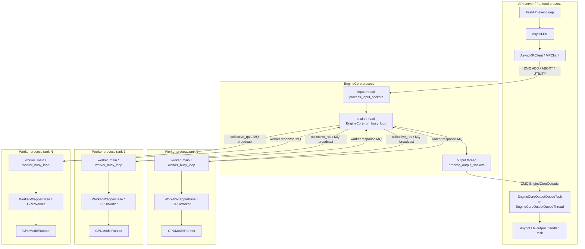
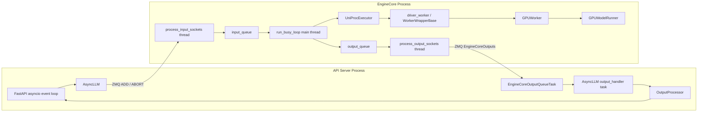
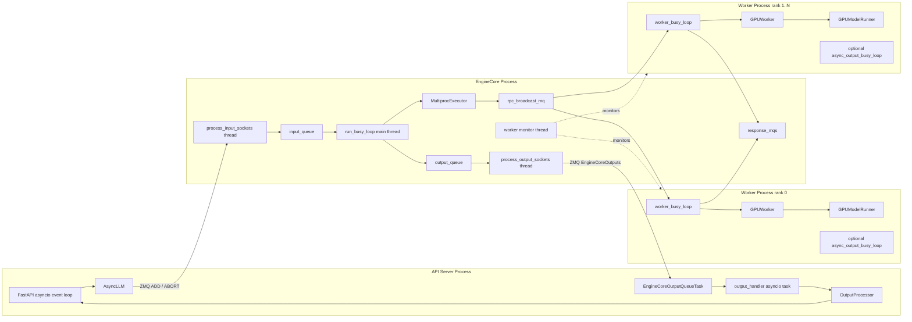

## vLLM V1 总体架构与启动初始化链路

> branch_name: 0.23.0
> source_baseline: `0fc695fc6d1d82e9a5ac6835ac8e4e1c83703665` (`v0.23.0`)

本文基于当前 `0.23.0` 源码重新整理 V1 总体架构、进程/线程模型、启动和对象
初始化链路。重点回答三个问题：API server 如何创建 engine，什么时候加载模型，
什么时候初始化 KV cache。

[TOC]

## 版本边界

本文只覆盖 `0.23.0` 源码里的 V1 路径，重点是在线服务启动、对象初始化、
进程线程模型，以及启动后如何进入请求处理循环。

阅读时可以先把 V1 拆成三层：

```text
OpenAI frontend 层
  负责 HTTP/API 协议、请求渲染、输入预处理、输出流式返回。

EngineCore 层
  负责请求生命周期、调度、KV cache 管理、调用 executor。

Worker / ModelRunner 层
  负责模型权重、KV cache tensors、forward、attention、采样。
```

本文不展开 V0，不深入 CUDA kernel，也不把每个 serving endpoint 都逐行分析。
如果后续要读单次请求的完整链路，可以继续看同目录下的
[`v1_01_request_lifecycle_0.23.0.md`](./v1_01_request_lifecycle_0.23.0.md)；
如果重点是 KV cache，可以继续看
[`kv_cache_study_manual_0.23.0.md`](./kv_cache_study_manual_0.23.0.md)。

## V1 总体架构

从一个 OpenAI API 请求进入，到后台 EngineCore 准备执行，V1 的主要组件可以
先按下面这张图建立全局印象：

```mermaid
flowchart LR
  subgraph Frontend["OpenAI frontend 层<br/>API server process"]
    Client["OpenAI Client"]
    Router["FastAPI Router<br/>chat_completion/api_router.py"]
    Serving["OpenAIServingChat<br/>chat_completion/serving.py"]
    AsyncLLM["AsyncLLM<br/>v1/engine/async_llm.py"]
    InputProcessor["InputProcessor<br/>v1/engine/input_processor.py"]
    OutputProcessor["OutputProcessor<br/>v1/engine/output_processor.py"]
    CoreClient["AsyncMPClient / DPAsyncMPClient / DPLBAsyncMPClient<br/>v1/engine/core_client.py"]
  end

  subgraph CoreLayer["EngineCore 层<br/>engine process"]
    EngineProc["EngineCoreProc<br/>v1/engine/core.py"]
    EngineCore["EngineCore<br/>v1/engine/core.py"]
    Scheduler["Scheduler / AsyncScheduler<br/>v1/core/sched"]
    KVManager["KVCacheManager<br/>v1/core/kv_cache_manager.py"]
    Executor["UniProcExecutor / MultiprocExecutor<br/>v1/executor"]
  end

  subgraph WorkerLayer["Worker / ModelRunner 层<br/>worker process or in-process driver worker"]
    WorkerProc["Worker process(es)<br/>multiproc_executor.py"]
    GPUWorker["GPUWorker<br/>v1/worker/gpu_worker.py"]
    ModelRunner["GPUModelRunner<br/>v1/worker/gpu/model_runner.py"]
    Attention["Attention backend / kernels"]
  end

  Client --> Router --> Serving --> AsyncLLM
  AsyncLLM --> InputProcessor
  AsyncLLM --> OutputProcessor
  AsyncLLM --> CoreClient
  CoreClient <-->|"ZMQ request / output"| EngineProc
  EngineProc --> EngineCore
  EngineCore --> Scheduler
  Scheduler --> KVManager
  EngineCore --> Executor
  Executor --> WorkerProc
  WorkerProc --> GPUWorker --> ModelRunner --> Attention
```



这张图里最容易混淆的是 `AsyncLLM` 和 `EngineCore`：

- `AsyncLLM` 在 API server 进程中，偏 frontend，负责把外部请求变成
  `EngineCoreRequest`，并把 `EngineCoreOutputs` 变成上层可消费的异步输出。
- `EngineCore` 在后台 engine 进程中，偏 runtime，负责调度、KV cache、
  executor 调用和请求状态推进。

## 主要职责边界

| 组件 | 所在文件 | 主要职责 |
| --- | --- | --- |
| API Router | [`chat_completion/api_router.py#L53`](../../../vllm/entrypoints/openai/chat_completion/api_router.py#L53) | 接收 HTTP 请求，调用 serving 对象，处理断连/取消。 |
| `OpenAIServingChat` | [`chat_completion/serving.py#L219`](../../../vllm/entrypoints/openai/chat_completion/serving.py#L219) | 校验请求、应用 chat template、构造 sampling/beam 参数、调用 engine client。 |
| `AsyncLLM` | [`async_llm.py#L73`](../../../vllm/v1/engine/async_llm.py#L73) | V1 frontend 对象，持有 input/output processor 和 EngineCore client。 |
| `InputProcessor` | [`input_processor.py#L223`](../../../vllm/v1/engine/input_processor.py#L223) | 构造/修正 `EngineCoreRequest`，为请求生成内部 request id。 |
| `OutputProcessor` | [`output_processor.py#L417`](../../../vllm/v1/engine/output_processor.py#L417) | 维护 request output state，处理 detokenize、abort、外部/内部 request id 映射。 |
| `EngineCoreClient` / `MPClient` | [`core_client.py#L477`](../../../vllm/v1/engine/core_client.py#L477) | 前端到 EngineCore 的进程间代理，负责 ZMQ、ready response、输出队列。 |
| `EngineCoreProc` | [`core.py#L867`](../../../vllm/v1/engine/core.py#L867) | EngineCore 进程包装层，负责 handshake、input/output socket 线程。 |
| `EngineCore` | [`core.py#L98`](../../../vllm/v1/engine/core.py#L98) | Runtime 核心对象，初始化 executor、KV cache、Scheduler，并驱动 step loop。 |
| `Scheduler` | [`scheduler.py#L65`](../../../vllm/v1/core/sched/scheduler.py#L65) | 维护 waiting/running 请求，做 continuous batching、KV block 分配与释放。 |
| `KVCacheManager` | [`kv_cache_manager.py#L75`](../../../vllm/v1/core/kv_cache_manager.py#L75) | Scheduler 侧 KV block 管理，包含 prefix caching 命中、分配、释放。 |
| `Executor` | [`multiproc_executor.py#L103`](../../../vllm/v1/executor/multiproc_executor.py#L103) | 管理 worker 执行模型，常见在线服务更常见走 `MultiprocExecutor`。 |
| `GPUWorker` | [`gpu_worker.py#L74`](../../../vllm/v1/worker/gpu_worker.py#L74) | worker 侧 device、模型、显存 profile、KV cache 初始化入口。 |
| `GPUModelRunner` | [`model_runner.py#L129`](../../../vllm/v1/worker/gpu/model_runner.py#L129) | 维护 worker 侧 batch/input/block table，执行 forward 和采样。 |

对应源码入口如下。行号基于 `0.23.0` 当前 worktree；如果后续源码移动，优先按
表中的类名或函数名重新搜索。

| 架构节点 | 建议入口 | 关注点 |
| --- | --- | --- |
| FastAPI Router | [`create_chat_completion()`](../../../vllm/entrypoints/openai/chat_completion/api_router.py#L53) | OpenAI chat completion HTTP 请求入口。 |
| OpenAI Serving | [`OpenAIServingChat`](../../../vllm/entrypoints/openai/chat_completion/serving.py#L83)、[`create_chat_completion()`](../../../vllm/entrypoints/openai/chat_completion/serving.py#L219) | 协议层校验、chat template、sampling/beam 参数、生成请求创建。 |
| Renderer | [`renderer_from_config()`](../../../vllm/renderers/registry.py#L79) | 根据配置选择 prompt/chat 渲染器。 |
| InputProcessor | [`InputProcessor.assign_request_id()`](../../../vllm/v1/engine/input_processor.py#L223)、[`process_inputs()`](../../../vllm/v1/engine/input_processor.py#L244) | 外部 request id 到内部 request id，输入预处理。 |
| AsyncLLM 初始化 | [`AsyncLLM.from_vllm_config()`](../../../vllm/v1/engine/async_llm.py#L203)、[`AsyncLLM.__init__()`](../../../vllm/v1/engine/async_llm.py#L73) | 前端 renderer、processor、EngineCore client 初始化。 |
| AsyncLLM 请求提交 | [`AsyncLLM.add_request()`](../../../vllm/v1/engine/async_llm.py#L280)、[`AsyncLLM.generate()`](../../../vllm/v1/engine/async_llm.py#L524) | 将前端请求提交给 EngineCoreClient。 |
| EngineCoreClient | [`make_async_mp_client()`](../../../vllm/v1/engine/core_client.py#L108)、[`AsyncMPClient.add_request_async()`](../../../vllm/v1/engine/core_client.py#L1054) | 前端进程与 EngineCore 进程的 ZMQ 通信。 |
| EngineCoreProc | [`EngineCoreProc.__init__()`](../../../vllm/v1/engine/core.py#L867)、[`run_engine_core()`](../../../vllm/v1/engine/core.py#L1118) | 子进程入口、握手、IO 线程。 |
| EngineCore | [`EngineCore.__init__()`](../../../vllm/v1/engine/core.py#L98)、[`EngineCore.step()`](../../../vllm/v1/engine/core.py#L443) | Executor、KV cache、Scheduler、单步执行循环。 |
| EngineCore IO 线程 | [`process_input_sockets()`](../../../vllm/v1/engine/core.py#L1512)、[`process_output_sockets()`](../../../vllm/v1/engine/core.py#L1625) | ZMQ 输入输出线程。 |
| KV cache 初始化 | [`_initialize_kv_caches()`](../../../vllm/v1/engine/core.py#L236) | profiling、KVCacheConfig、worker KV cache 初始化。 |
| Scheduler | [`Scheduler`](../../../vllm/v1/core/sched/scheduler.py#L65)、[`Scheduler.schedule()`](../../../vllm/v1/core/sched/scheduler.py#L347) | continuous batching、KV block 分配、抢占。 |
| KVCacheManager | [`KVCacheManager`](../../../vllm/v1/core/kv_cache_manager.py#L75)、[`allocate_slots()`](../../../vllm/v1/core/kv_cache_manager.py#L281) | Scheduler 侧 KV block 所有权管理。 |
| Executor 选择 | [`Executor.get_class()`](../../../vllm/v1/executor/abstract.py#L48) | 选择 uniproc、multiproc、Ray 或外部 executor。 |
| Executor 执行接口 | [`Executor.execute_model()`](../../../vllm/v1/executor/abstract.py#L219)、[`MultiprocExecutor.execute_model()`](../../../vllm/v1/executor/multiproc_executor.py#L307) | EngineCore 到 worker 的执行编排。 |
| GPU Worker | [`GPUWorker.execute_model()`](../../../vllm/v1/worker/gpu_worker.py#L806)、[`GPUWorker.initialize_from_config()`](../../../vllm/v1/worker/gpu_worker.py#L563) | worker 侧模型执行、KV tensor 初始化。 |
| GPUModelRunner | [`GPUModelRunner`](../../../vllm/v1/worker/gpu/model_runner.py#L129)、[`add_requests()`](../../../vllm/v1/worker/gpu/model_runner.py#L742)、[`execute_model()`](../../../vllm/v1/worker/gpu/model_runner.py#L1082) | 输入张量准备、block table、forward、采样。 |
| OutputProcessor | [`OutputProcessor`](../../../vllm/v1/engine/output_processor.py#L417)、[`process_outputs()`](../../../vllm/v1/engine/output_processor.py#L588) | 反分词、stop 条件、组装 `RequestOutput`。 |

## V1 进程与线程模型

普通在线服务的 V1 路径不是单个 Python 调用栈，而是几个进程和线程配合：



图里的 `rank 0 / rank 1 / rank N` 表示 worker 进程会按并行配置展开；单卡
`UniProcExecutor` 可以没有额外 worker 子进程，而单机 TP/PP 或多卡
`MultiprocExecutor` 通常会有多个 worker 子进程。

按源码对应起来：

- `AsyncLLM` 在首次 add/generate 请求时启动 output handler：
  [`async_llm.py#L637`](../../../vllm/v1/engine/async_llm.py#L637)
  到 [`async_llm.py#L707`](../../../vllm/v1/engine/async_llm.py#L707)。
- `AsyncMPClient` 会创建 `EngineCoreOutputQueueTask` 消费 EngineCore 输出：
  [`core_client.py#L990`](../../../vllm/v1/engine/core_client.py#L990)
  到 [`core_client.py#L1035`](../../../vllm/v1/engine/core_client.py#L1035)。
- 同步 `MPClient` 路径会创建 `EngineCoreOutputQueueThread`：
  [`core_client.py#L793`](../../../vllm/v1/engine/core_client.py#L793)
  到 [`core_client.py#L830`](../../../vllm/v1/engine/core_client.py#L830)。
- EngineCore 进程内部创建 input/output socket 线程：
  [`core.py#L943`](../../../vllm/v1/engine/core.py#L943)
  到 [`core.py#L965`](../../../vllm/v1/engine/core.py#L965)。
- EngineCore 主线程进入 busy loop：
  [`core.py#L1223`](../../../vllm/v1/engine/core.py#L1223)。
- `MultiprocExecutor` 的 worker 子进程进入 worker busy loop：
  [`multiproc_executor.py#L969`](../../../vllm/v1/executor/multiproc_executor.py#L969)。

这里要抓住一个关键点：启动阶段完成后，API server 进程不会直接跑模型 forward。
它通过 EngineCore client 把请求发给后台 EngineCore；EngineCore 再通过 executor
驱动 worker/model runner。

## 进程与线程模型扩展

上面的图是最常见的单 API server、单 DP 视角。0.23.0 里还有几个扩展路径：

| 场景 | 主要变化 | 入口 |
| --- | --- | --- |
| DP=1 | 一个 frontend 管一个 EngineCore，通常走 `AsyncMPClient`。 | [`core_client.py#L108`](../../../vllm/v1/engine/core_client.py#L108) |
| DP>1 + external LB | 外部组件做 LB，每个 frontend 只管理本地 engines，client 类型是 `DPAsyncMPClient`。 | [`core_client.py#L114`](../../../vllm/v1/engine/core_client.py#L114) |
| DP>1 + internal LB | vLLM 内部做 request 到 engine 的选择，client 类型是 `DPLBAsyncMPClient`。 | [`core_client.py#L124`](../../../vllm/v1/engine/core_client.py#L124) |
| Ray backend | `launch_core_engines()` 走 Ray actor 启动路径。 | [`utils.py#L1108`](../../../vllm/v1/engine/utils.py#L1108) |
| Coordinator | DP internal/external LB 下可能启动 `DPCoordinator`。 | [`utils.py#L1087`](../../../vllm/v1/engine/utils.py#L1087) |
| Pipeline parallel | `EngineCore` 创建 `batch_queue`，`step_fn` 切到 `step_with_batch_queue`。 | [`core.py#L209`](../../../vllm/v1/engine/core.py#L209) |

学习顺序建议先看 DP=1 + `MultiprocExecutor`。这条路径已经覆盖启动、模型加载、
KV cache 初始化、Scheduler、worker forward 的主线；DP/Ray/coordinator 可以作为
第二轮扩展阅读。

### 单卡 UniProcExecutor 场景

单卡或 `world_size == 1` 时，默认 executor 通常是 `UniProcExecutor`。这时
API Server 和 EngineCore 仍然是两个进程，但 worker 不再是额外子进程；实际
`driver_worker`、`GPUWorker` 和 `GPUModelRunner` 都在 EngineCore 进程内。



这一模式的关键点：

- `UniProcExecutor._init_executor()` 创建 `WorkerWrapperBase(rpc_rank=0)`：
  [`uniproc_executor.py#L48`](../../../vllm/v1/executor/uniproc_executor.py#L48)。
- `driver_worker.init_worker()` / `init_device()` / `load_model()` 在 EngineCore
  进程内同步执行：
  [`uniproc_executor.py#L62`](../../../vllm/v1/executor/uniproc_executor.py#L62)
  到 [`uniproc_executor.py#L68`](../../../vllm/v1/executor/uniproc_executor.py#L68)。
- `collective_rpc()` 实际是直接函数调用：
  [`uniproc_executor.py#L79`](../../../vllm/v1/executor/uniproc_executor.py#L79)
  到 [`uniproc_executor.py#L104`](../../../vllm/v1/executor/uniproc_executor.py#L104)。
- 调试 `GPUWorker.execute_model()` 时，UniProc 路径不需要跨 worker 子进程，
  断点体验更直接。

### 单机多卡 MultiprocExecutor 场景

当 `tensor_parallel_size > 1`、`pipeline_parallel_size > 1` 或其他并行配置让
`world_size > 1` 时，常见路径是 `MultiprocExecutor`。此时 EngineCore 进程只负责
调度和 RPC 编排，模型执行发生在 worker 子进程。



这一模式的关键点：

- `MultiprocExecutor._init_executor()` 创建 `rpc_broadcast_mq`：
  [`multiproc_executor.py#L135`](../../../vllm/v1/executor/multiproc_executor.py#L135)
  到 [`multiproc_executor.py#L153`](../../../vllm/v1/executor/multiproc_executor.py#L153)。
- 遍历本地 ranks 并创建 worker 子进程：
  [`multiproc_executor.py#L158`](../../../vllm/v1/executor/multiproc_executor.py#L158)
  到 [`multiproc_executor.py#L201`](../../../vllm/v1/executor/multiproc_executor.py#L201)。
- `WorkerProc.make_worker_process()` 通过 `multiprocessing.Process` 拉起
  `WorkerProc.worker_main()`：
  [`multiproc_executor.py#L659`](../../../vllm/v1/executor/multiproc_executor.py#L659)
  到 [`multiproc_executor.py#L709`](../../../vllm/v1/executor/multiproc_executor.py#L709)。
- worker 初始化完成后通过 ready pipe 回报 READY：
  [`multiproc_executor.py#L862`](../../../vllm/v1/executor/multiproc_executor.py#L862)
  到 [`multiproc_executor.py#L869`](../../../vllm/v1/executor/multiproc_executor.py#L869)。
- worker 长期运行 `worker_busy_loop()`，从 `rpc_broadcast_mq` 取 RPC 并调用
  `GPUWorker` 方法：
  [`multiproc_executor.py#L969`](../../../vllm/v1/executor/multiproc_executor.py#L969)
  到 [`multiproc_executor.py#L980`](../../../vllm/v1/executor/multiproc_executor.py#L980)。

### 各长期线程与任务

| 所在进程 | 线程/任务 | 入口 | 主要职责 |
| --- | --- | --- | --- |
| API Server | FastAPI event loop | OpenAI API server | HTTP、SSE、请求 generator。 |
| API Server | `AsyncLLM.output_handler` asyncio task | [`async_llm.py#L637`](../../../vllm/v1/engine/async_llm.py#L637) | 拉取 EngineCore 输出并调用 `OutputProcessor`。 |
| API Server | `EngineCoreOutputQueueTask` | [`core_client.py#L990`](../../../vllm/v1/engine/core_client.py#L990) | 异步消费 EngineCore output ZMQ socket。 |
| API Server | `EngineCoreOutputQueueThread` | [`core_client.py#L793`](../../../vllm/v1/engine/core_client.py#L793) | 同步 client 路径下消费 EngineCore output ZMQ socket。 |
| EngineCore | main thread | [`run_busy_loop()`](../../../vllm/v1/engine/core.py#L1223) | 处理 input queue，执行 engine step。 |
| EngineCore | input IO thread | [`process_input_sockets()`](../../../vllm/v1/engine/core.py#L1512) | 读 ZMQ 请求、反序列化、预处理、写入 `input_queue`。 |
| EngineCore | output IO thread | [`process_output_sockets()`](../../../vllm/v1/engine/core.py#L1625) | 从 `output_queue` 取结果，编码并发回前端。 |
| EngineCore | worker monitor thread | [`start_worker_monitor()`](../../../vllm/v1/executor/multiproc_executor.py#L260) | 监控 worker 子进程死亡。 |
| Worker | worker main thread | [`worker_main()`](../../../vllm/v1/executor/multiproc_executor.py#L807) | 初始化 worker，进入 busy loop。 |
| Worker | worker busy loop | [`worker_busy_loop()`](../../../vllm/v1/executor/multiproc_executor.py#L969) | 从 MQ 取 RPC，调用 `GPUWorker` 方法。 |
| Worker | async output thread | [`async_output_busy_loop()`](../../../vllm/v1/executor/multiproc_executor.py#L950) | async scheduling 时异步处理 worker 输出。 |
| Worker | death pipe monitor | [`monitor_death_pipe()`](../../../vllm/v1/executor/multiproc_executor.py#L916) | 父进程退出时关闭 worker queues。 |

### 关键队列和通信通道

| 通道 | 方向 | 使用场景 |
| --- | --- | --- |
| frontend input ZMQ | API Server -> EngineCore input thread | `ADD`、`ABORT`、utility request。 |
| `EngineCoreProc.input_queue` | input thread -> EngineCore busy loop | 让 socket IO 与调度执行解耦。 |
| `EngineCoreProc.aborts_queue` | input thread -> EngineCore busy loop | abort 请求可被更积极地处理。 |
| `EngineCoreProc.output_queue` | EngineCore busy loop -> output thread | `EngineCoreOutputs`、dead sentinel。 |
| frontend output ZMQ | EngineCore output thread -> API Server output queue task/thread | 返回 `EngineCoreOutputs`。 |
| API `outputs_queue` | output socket task/thread -> `AsyncLLM.output_handler` | 前端异步消费 EngineCore 输出。 |
| `rpc_broadcast_mq` | MultiprocExecutor -> worker processes | 广播 `execute_model`、`sample_tokens`、`initialize_from_config` 等 RPC。 |
| `worker_response_mq` | worker process -> MultiprocExecutor | 返回模型输出、采样结果或异常。 |
| `ready_pipe` | worker process -> MultiprocExecutor | worker 完成模型加载后发送 READY。 |
| `death_pipe` | MultiprocExecutor parent -> worker process | 父进程退出时通知 worker 退出。 |

### 一次请求跨线程的高层路径

只看进程、线程和队列，不展开业务细节：

```text
API Server FastAPI task
  -> OpenAI serving 构造 EngineCoreRequest
  -> AsyncLLM / EngineCoreClient 发送 ZMQ ADD

EngineCore input IO thread
  -> process_input_sockets
  -> 反序列化 EngineCoreRequest
  -> preprocess_add_request
  -> input_queue.put_nowait(...)

EngineCore main thread
  -> run_busy_loop
  -> _process_input_queue
  -> _process_engine_step
  -> Scheduler.schedule
  -> model_executor.execute_model

UniProcExecutor:
  -> 直接调用 driver_worker.execute_model

MultiprocExecutor:
  -> rpc_broadcast_mq.enqueue(...)
  -> WorkerProc.worker_busy_loop
  -> GPUWorker.execute_model

EngineCore main thread
  -> Scheduler.update_from_output
  -> output_queue.put(...)

EngineCore output IO thread
  -> process_output_sockets
  -> msgpack encode
  -> ZMQ PUSH to frontend

API Server output queue task / output_handler task
  -> EngineCoreClient.get_output_async
  -> OutputProcessor.process_outputs
  -> RequestOutput queue / streaming response
```

### 源码走读建议

第一轮只需要沿这些入口走，不建议先读 kernel：

| 目标 | 建议入口 |
| --- | --- |
| EngineCore 后台进程如何启动 | [`CoreEngineProcManager`](../../../vllm/v1/engine/utils.py#L111) |
| EngineCore 子进程入口 | [`EngineCoreProc.run_engine_core()`](../../../vllm/v1/engine/core.py#L1118) |
| EngineCoreProc 初始化和 IO 线程 | [`EngineCoreProc.__init__()`](../../../vllm/v1/engine/core.py#L867) |
| EngineCore busy loop | [`run_busy_loop()`](../../../vllm/v1/engine/core.py#L1223) |
| 输入 IO 线程 | [`process_input_sockets()`](../../../vllm/v1/engine/core.py#L1512) |
| 输出 IO 线程 | [`process_output_sockets()`](../../../vllm/v1/engine/core.py#L1625) |
| 前端输出任务 | [`AsyncLLM._run_output_handler()`](../../../vllm/v1/engine/async_llm.py#L637) |
| 前端 output socket 任务 | [`EngineCoreOutputQueueTask`](../../../vllm/v1/engine/core_client.py#L990) |
| Multiproc worker 入口 | [`WorkerProc.worker_main()`](../../../vllm/v1/executor/multiproc_executor.py#L807) |
| Multiproc worker busy loop | [`worker_busy_loop()`](../../../vllm/v1/executor/multiproc_executor.py#L969) |

## 同一请求的三层状态

V1 中同一个请求会在三层有不同状态对象。读代码时如果只盯着 request id，
很容易觉得它在“跳来跳去”：

| 层次 | 状态对象 | 主要作用 |
| --- | --- | --- |
| Frontend / output 层 | `OutputProcessor.request_states` | 记录外部输出、detokenizer、streaming queue、外部/内部 request id 映射。 |
| EngineCore / scheduler 层 | `Scheduler.requests`、`waiting`、`running` | 记录调度状态、已计算 token、KV blocks、是否 running/waiting。 |
| Worker / model runner 层 | `GPUModelRunner.req_states`、`block_tables` | 记录 worker 侧 batch slot、token ids、物理 KV block table。 |

对应代码：

- `OutputProcessor` 维护 request state：
  [`output_processor.py#L431`](../../../vllm/v1/engine/output_processor.py#L431)
  和 [`output_processor.py#L512`](../../../vllm/v1/engine/output_processor.py#L512)。
- `Scheduler` 维护 `requests`、`waiting`、`running`：
  [`scheduler.py#L156`](../../../vllm/v1/core/sched/scheduler.py#L156)
  到 [`scheduler.py#L168`](../../../vllm/v1/core/sched/scheduler.py#L168)，
  新请求入口是
  [`Scheduler.add_request()`](../../../vllm/v1/core/sched/scheduler.py#L1801)。
- `GPUModelRunner.add_requests()` 消费 `SchedulerOutput`，更新 worker 侧状态和
  block table：
  [`model_runner.py#L742`](../../../vllm/v1/worker/gpu/model_runner.py#L742)。

## 请求 ID 的两层语义

OpenAI serving 层会先构造一个面向 API 响应的 request id。例如 chat completion
路径在
[`serving.py#L256`](../../../vllm/entrypoints/openai/chat_completion/serving.py#L256)
生成 `chatcmpl-...` 前缀的 id，并在多输入场景下派生子 request id：
[`serving.py#L279`](../../../vllm/entrypoints/openai/chat_completion/serving.py#L279)。

进入 V1 后，`InputProcessor.assign_request_id()` 会保留外部 id 到
`external_req_id`，再追加随机后缀生成内部 id：
[`input_processor.py#L223`](../../../vllm/v1/engine/input_processor.py#L223)
到 [`input_processor.py#L240`](../../../vllm/v1/engine/input_processor.py#L240)。

所以：

```text
external_req_id
  面向 API/user，可用于响应和外部 abort。

request_id
  EngineCore 内部唯一 id，用于 Scheduler、KV cache、worker block table。
```

`OutputProcessor` 会维护外部 id 到内部 id 的映射：
[`output_processor.py#L431`](../../../vllm/v1/engine/output_processor.py#L431)
到 [`output_processor.py#L541`](../../../vllm/v1/engine/output_processor.py#L541)。

## 启动主线

```text
OpenAI API server startup
  -> AsyncEngineArgs.create_engine_config()
  -> build_async_engine_client_from_engine_args()
  -> AsyncLLM.from_vllm_config()
  -> Executor.get_class(vllm_config)
  -> AsyncLLM.__init__()
  -> EngineCoreClient.make_async_mp_client()
  -> MPClient.__init__()
  -> launch_core_engines()
  -> EngineCoreProc.run_engine_core()
  -> EngineCoreProc.__init__()
  -> EngineCore.__init__()
  -> executor_class(vllm_config)
  -> worker initialization and model loading
  -> EngineCore._initialize_kv_caches()
  -> Scheduler(...)
  -> EngineCore IO threads ready
  -> API server ready
```

启动阶段已经会加载模型，并且会完成 KV cache 的容量规划、显存 profile、
worker 侧 KV tensor 初始化和 warmup。也就是说，请求到来前，模型权重与
KV cache 基础结构通常已经准备好。

## 代码走读顺序

如果目的是源码走读，建议按下面这张表打断点，不要从大文件顶部顺读。

| 顺序 | 断点 | 主要看什么 |
| --- | --- | --- |
| 1 | [`build_async_engine_client_from_engine_args()`](../../../vllm/entrypoints/openai/api_server.py#L108) | CLI/serve 参数如何变成 `VllmConfig`。 |
| 2 | [`AsyncLLM.from_vllm_config()`](../../../vllm/v1/engine/async_llm.py#L203) | `Executor.get_class(vllm_config)` 选出的 executor class。 |
| 3 | [`AsyncLLM.__init__()`](../../../vllm/v1/engine/async_llm.py#L73) | 前端 renderer、input/output processor、EngineCore client。 |
| 4 | [`EngineCoreClient.make_async_mp_client()`](../../../vllm/v1/engine/core_client.py#L108) | DP=1、外部 LB、内部 LB 下 client 类型选择。 |
| 5 | [`MPClient.__init__()`](../../../vllm/v1/engine/core_client.py#L477) | ZMQ sockets、engine 启动、ready response。 |
| 6 | [`launch_core_engines()`](../../../vllm/v1/engine/utils.py#L1049) | 本地/DP/Ray/coordinator 分支。 |
| 7 | [`EngineCoreProc.run_engine_core()`](../../../vllm/v1/engine/core.py#L1118) | 后台 EngineCore 进程如何决定 `EngineCoreProc` / `DPEngineCoreProc`。 |
| 8 | [`EngineCoreProc.__init__()`](../../../vllm/v1/engine/core.py#L867) | handshake、IO 线程、`EngineCore.__init__()`。 |
| 9 | [`EngineCore.__init__()`](../../../vllm/v1/engine/core.py#L98) | executor、KV cache、Scheduler。 |
| 10 | [`EngineCore.run_busy_loop()`](../../../vllm/v1/engine/core.py#L1223) | 启动结束后 EngineCore 如何等待请求并 step。 |

每一站建议记录：

```text
vllm_config.model_config.model
vllm_config.model_config.max_model_len
vllm_config.cache_config.block_size
vllm_config.cache_config.num_gpu_blocks
vllm_config.parallel_config.world_size
vllm_config.parallel_config.data_parallel_size
executor_class
```

## API server 到 AsyncLLM

入口在
[`build_async_engine_client_from_engine_args()`](../../../vllm/entrypoints/openai/api_server.py#L108)。
它先调用 `engine_args.create_engine_config()` 创建 `VllmConfig`，再进入
[`AsyncLLM.from_vllm_config()`](../../../vllm/v1/engine/async_llm.py#L203)。

`from_vllm_config()` 里的 `cls` 就是当前类本身。这里是类方法，所以
`cls(...)` 等价于构造一个 `AsyncLLM(...)`；如果未来有子类继承
`AsyncLLM`，通过子类调用时 `cls` 就会是那个子类。

关键代码：

- `AsyncLLM.from_vllm_config()` 选择 executor：
  [`async_llm.py#L217`](../../../vllm/v1/engine/async_llm.py#L217)
  到 [`async_llm.py#L224`](../../../vllm/v1/engine/async_llm.py#L224)。
- `AsyncLLM.__init__()` 保存 `VllmConfig`：
  [`async_llm.py#L110`](../../../vllm/v1/engine/async_llm.py#L110)。
- renderer 与输入输出处理器：
  [`async_llm.py#L132`](../../../vllm/v1/engine/async_llm.py#L132)
  到 [`async_llm.py#L143`](../../../vllm/v1/engine/async_llm.py#L143)。
- 创建 EngineCore client：
  [`async_llm.py#L145`](../../../vllm/v1/engine/async_llm.py#L145)
  到 [`async_llm.py#L153`](../../../vllm/v1/engine/async_llm.py#L153)。

## EngineCoreClient 与 MPClient

[`EngineCoreClient.make_async_mp_client()`](../../../vllm/v1/engine/core_client.py#L108)
根据 `parallel_config.data_parallel_size` 和
`data_parallel_external_lb` 选择客户端类型：

- DP=1：使用 `AsyncMPClient`。
- DP>1 且外部 LB：使用 `DPAsyncMPClient`。
- DP>1 且内部 LB：使用 `DPLBAsyncMPClient`。

`MPClient.__init__()` 是多进程 EngineCore 的前端代理。它负责：

- 创建 ZMQ context 和 sockets：
  [`core_client.py#L487`](../../../vllm/v1/engine/core_client.py#L487)
  到 [`core_client.py#L559`](../../../vllm/v1/engine/core_client.py#L559)。
- 如果没有外部传入 engine 地址，则调用
  [`launch_core_engines()`](../../../vllm/v1/engine/core_client.py#L570)
  启动后台 EngineCore。
- 根据 DP 配置计算当前 client 管理哪些 engine rank：
  [`core_client.py#L593`](../../../vllm/v1/engine/core_client.py#L593)
  到 [`core_client.py#L610`](../../../vllm/v1/engine/core_client.py#L610)。

### MPClient ready response

`MPClient.__init__()` 不会在 EngineCore 子进程还没准备好时就返回。它会等待每个
engine 通过 input socket 发回 ready message：

[`core_client.py#L612`](../../../vllm/v1/engine/core_client.py#L612)
到 [`core_client.py#L630`](../../../vllm/v1/engine/core_client.py#L630)。

收到 ready payload 后，前端会调用 `_apply_ready_response()`：

[`core_client.py#L711`](../../../vllm/v1/engine/core_client.py#L711)
到 [`core_client.py#L730`](../../../vllm/v1/engine/core_client.py#L730)。

这一步很关键：EngineCore 进程在 `_initialize_kv_caches()` 中可能 auto-fit
`max_model_len`，也会得到 `num_gpu_blocks` 和修正后的 `block_size`。这些值要通过
ready response 同步回前端 `vllm_config`，否则 API server 侧看到的配置会和
EngineCore 侧不一致。

走读时建议观察：

```text
response.max_model_len
response.num_gpu_blocks
response.block_size
vllm_config.cache_config.num_gpu_blocks
```

## launch_core_engines()

[`launch_core_engines()`](../../../vllm/v1/engine/utils.py#L1049)
是启动 EngineCore 后台组件的 context manager。

核心变量：

- `dp_size`：
  [`utils.py#L1066`](../../../vllm/v1/engine/utils.py#L1066)，全局 data parallel engine 数。
- `local_engine_count`：
  [`utils.py#L1067`](../../../vllm/v1/engine/utils.py#L1067)，当前节点本地 engine 数。
- `local_start_index`：
  [`utils.py#L1068`](../../../vllm/v1/engine/utils.py#L1068)，离线/外部启动时本地 DP rank 起点。
- `dp_rank`：
  [`utils.py#L1069`](../../../vllm/v1/engine/utils.py#L1069)，当前进程所在 DP rank。
- `local_engines_only`：
  [`utils.py#L1071`](../../../vllm/v1/engine/utils.py#L1071)，client 是否只管理本地 engine。
- `offline_mode`：
  [`utils.py#L1073`](../../../vllm/v1/engine/utils.py#L1073)，通过 `local_start_index is not None` 判断。

非 Ray 路径中，`engines_to_handshake` 的含义是“当前 frontend 需要等待哪些
EngineCore 完成握手”：

- offline mode：只握手本地一个 engine。
- `dp_rank == 0`：rank 0 需要握手所有 DP engine，因为它可能持有 coordinator。
- `dp_rank > 0`：只握手自己管理的本地 engines。

相关代码在
[`utils.py#L1121`](../../../vllm/v1/engine/utils.py#L1121)
到 [`utils.py#L1141`](../../../vllm/v1/engine/utils.py#L1141)。

## EngineCoreProc.run_engine_core()

[`EngineCoreProc.run_engine_core()`](../../../vllm/v1/engine/core.py#L1118)
运行在后台进程中。它先设置进程标题、tracer、DP rank，再决定具体创建哪种
EngineCore：

- data parallel + MoE：创建 `DPEngineCoreProc`。
- 普通场景或非 MoE DP：创建 `EngineCoreProc`。

判断逻辑在
[`core.py#L1127`](../../../vllm/v1/engine/core.py#L1127)
到 [`core.py#L1164`](../../../vllm/v1/engine/core.py#L1164)。

一般单机单卡或单机 TP 场景，主要看 `EngineCoreProc`；`DPEngineCoreProc`
更偏向 DP/MoE 场景。

## EngineCoreProc.__init__()

[`EngineCoreProc.__init__()`](../../../vllm/v1/engine/core.py#L867)
是带 ZMQ 包装的 EngineCore 初始化：

1. 创建 input/output queue：
   [`core.py#L879`](../../../vllm/v1/engine/core.py#L879)
   到 [`core.py#L883`](../../../vllm/v1/engine/core.py#L883)。
2. 执行 ZMQ handshake，拿到 input/output/coordinator 地址：
   [`core.py#L896`](../../../vllm/v1/engine/core.py#L896)
   到 [`core.py#L902`](../../../vllm/v1/engine/core.py#L902)。
3. 初始化 DP 相关状态：
   [`core.py#L903`](../../../vllm/v1/engine/core.py#L903)
   到 [`core.py#L928`](../../../vllm/v1/engine/core.py#L928)。
4. 调用 `super().__init__()`，进入真正的
   [`EngineCore.__init__()`](../../../vllm/v1/engine/core.py#L98)。
5. EngineCore 初始化结束后，再启动 socket IO 线程。

### EngineCoreProc 的 IO 线程

`EngineCoreProc.__init__()` 在 `EngineCore.__init__()` 完成后创建两个后台线程：

- input thread：
  [`core.py#L943`](../../../vllm/v1/engine/core.py#L943)
  到 [`core.py#L955`](../../../vllm/v1/engine/core.py#L955)。
- output thread：
  [`core.py#L956`](../../../vllm/v1/engine/core.py#L956)
  到 [`core.py#L965`](../../../vllm/v1/engine/core.py#L965)。

线程职责：

```text
ZMQ input socket
  -> process_input_sockets()
  -> input_queue
  -> run_busy_loop()

run_busy_loop()
  -> output_queue
  -> process_output_sockets()
  -> ZMQ output socket
```

input thread 会反序列化 ADD/ABORT/UTILITY 请求。ADD 请求会先调用
`preprocess_add_request()`，再放入 `input_queue`：

[`core.py#L1512`](../../../vllm/v1/engine/core.py#L1512)
到 [`core.py#L1543`](../../../vllm/v1/engine/core.py#L1543)。

ABORT 会同时进入 `aborts_queue` 和 `input_queue`，这样既能尽快处理取消，又能
保持输入队列顺序：

[`core.py#L1535`](../../../vllm/v1/engine/core.py#L1535)
到 [`core.py#L1543`](../../../vllm/v1/engine/core.py#L1543)。

## EngineCore.__init__()

[`EngineCore.__init__()`](../../../vllm/v1/engine/core.py#L98)
是启动链路最重要的一段：

```text
EngineCore.__init__
  -> load_general_plugins
  -> save vllm_config / log_stats
  -> self.model_executor = executor_class(vllm_config)
  -> maybe elastic EP scale-up before KV init
  -> _initialize_kv_caches()
  -> StructuredOutputManager
  -> Scheduler = scheduler_config.get_scheduler_cls()
  -> resolve_kv_cache_block_sizes()
  -> self.scheduler = Scheduler(...)
  -> maybe initialize KV output aggregator
  -> maybe collect KV connector handshake metadata
  -> maybe create pipeline-parallel batch_queue
  -> maybe create request_block_hasher for prefix cache / KV connector
  -> choose step_fn
```

代码对应关系：

- 创建 executor：
  [`core.py#L121`](../../../vllm/v1/engine/core.py#L121)
  到 [`core.py#L124`](../../../vllm/v1/engine/core.py#L124)。
- 初始化 KV cache：
  [`core.py#L131`](../../../vllm/v1/engine/core.py#L131)
  到 [`core.py#L132`](../../../vllm/v1/engine/core.py#L132)。
- 获取 Scheduler class：
  [`core.py#L135`](../../../vllm/v1/engine/core.py#L135)
  到 [`core.py#L137`](../../../vllm/v1/engine/core.py#L137)。
- 修正 scheduler/hash block size：
  [`core.py#L145`](../../../vllm/v1/engine/core.py#L145)
  到 [`core.py#L147`](../../../vllm/v1/engine/core.py#L147)。
- 创建 Scheduler 实例：
  [`core.py#L149`](../../../vllm/v1/engine/core.py#L149)
  到 [`core.py#L157`](../../../vllm/v1/engine/core.py#L157)。
- 选择 `step` 或 `step_with_batch_queue`：
  [`core.py#L217`](../../../vllm/v1/engine/core.py#L217)
  到 [`core.py#L219`](../../../vllm/v1/engine/core.py#L219)。

普通非 pipeline parallel 场景下，`batch_queue` 通常是 `None`，所以
`self.step_fn` 通常指向 `self.step`。

## EngineCore busy loop

EngineCore 初始化完成后，`run_engine_core()` 会进入：

[`engine_core.run_busy_loop()`](../../../vllm/v1/engine/core.py#L1188)。

busy loop 主体很短：

[`run_busy_loop()`](../../../vllm/v1/engine/core.py#L1223)
到 [`core.py#L1231`](../../../vllm/v1/engine/core.py#L1231)。

它只做两件事：

```text
_process_input_queue()
  处理 ADD / ABORT / UTILITY / EXECUTOR_FAILED

_process_engine_step()
  如果有请求，调用 step_fn 推进一轮调度和执行
```

`_process_input_queue()` 会在没有请求时阻塞等待 input queue：

[`core.py#L1233`](../../../vllm/v1/engine/core.py#L1233)
到 [`core.py#L1262`](../../../vllm/v1/engine/core.py#L1262)。

请求分发在 `_handle_client_request()`：

[`core.py#L1336`](../../../vllm/v1/engine/core.py#L1336)
到 [`core.py#L1369`](../../../vllm/v1/engine/core.py#L1369)。

走读时要把这个循环和 `EngineCore.step()` 分开理解：

- busy loop 是后台进程的生命周期循环。
- `step()` 是有请求时推进一次模型执行的计算循环。

## MultiprocExecutor 与 UniProcExecutor

常见在线服务默认更容易走多进程路径，最终 executor class 常见是
`MultiprocExecutor`；调试、禁用 V1 多进程或某些特殊本地路径可能走
`UniProcExecutor`。

`MultiprocExecutor`：

- 类定义：
  [`multiproc_executor.py#L103`](../../../vllm/v1/executor/multiproc_executor.py#L103)。
- `_init_executor()` 中设置 worker 环境和分布式初始化地址：
  [`multiproc_executor.py#L110`](../../../vllm/v1/executor/multiproc_executor.py#L110)
  到 [`multiproc_executor.py#L130`](../../../vllm/v1/executor/multiproc_executor.py#L130)。
- 创建本地 worker processes：
  [`multiproc_executor.py#L158`](../../../vllm/v1/executor/multiproc_executor.py#L158)
  到 [`multiproc_executor.py#L201`](../../../vllm/v1/executor/multiproc_executor.py#L201)。
- 等待 message queues ready：
  [`multiproc_executor.py#L222`](../../../vllm/v1/executor/multiproc_executor.py#L222)
  到 [`multiproc_executor.py#L234`](../../../vllm/v1/executor/multiproc_executor.py#L234)。

`UniProcExecutor`：

- 类定义：
  [`uniproc_executor.py#L45`](../../../vllm/v1/executor/uniproc_executor.py#L45)。
- 创建单个 driver worker：
  [`uniproc_executor.py#L48`](../../../vllm/v1/executor/uniproc_executor.py#L48)
  到 [`uniproc_executor.py#L57`](../../../vllm/v1/executor/uniproc_executor.py#L57)。
- 初始化 worker、device、加载模型：
  [`uniproc_executor.py#L62`](../../../vllm/v1/executor/uniproc_executor.py#L62)
  到 [`uniproc_executor.py#L69`](../../../vllm/v1/executor/uniproc_executor.py#L69)。

注意 `current_platform.update_block_size_for_backend(vllm_config)` 在
`UniProcExecutor` 中也会调用；多进程 worker 初始化路径中也会处理平台相关
block size 修正。它属于平台/backend 适配，不是 multiproc 与 uniproc 的业务差异。

### MultiprocExecutor 执行期走读

启动期创建 worker 后，真正请求执行时会从
[`MultiprocExecutor.execute_model()`](../../../vllm/v1/executor/multiproc_executor.py#L307)
进入：

```text
MultiprocExecutor.execute_model()
  -> collective_rpc("execute_model")
  -> rpc_broadcast_mq.enqueue(...)
  -> WorkerProc.worker_busy_loop()
  -> WorkerWrapperBase.execute_model()
  -> GPUWorker.execute_model()
```

Worker 子进程在启动成功后会进入
[`worker_busy_loop()`](../../../vllm/v1/executor/multiproc_executor.py#L969)：

[`multiproc_executor.py#L969`](../../../vllm/v1/executor/multiproc_executor.py#L969)
到 [`multiproc_executor.py#L980`](../../../vllm/v1/executor/multiproc_executor.py#L980)。

它从 `rpc_broadcast_mq` 取出 method/args，然后在真实 worker 上调用对应方法。

worker 输出会进入 `handle_output()`：

[`multiproc_executor.py#L941`](../../../vllm/v1/executor/multiproc_executor.py#L941)
到 [`multiproc_executor.py#L949`](../../../vllm/v1/executor/multiproc_executor.py#L949)。

如果启用 async scheduling，输出先进入 async output thread；否则直接进入
worker response MQ。

### UniProcExecutor 执行期走读

`UniProcExecutor` 没有 worker 子进程和 MQ 广播。它在
[`collective_rpc()`](../../../vllm/v1/executor/uniproc_executor.py#L79)
里直接 `run_method(self.driver_worker, method, args, kwargs)`：

[`uniproc_executor.py#L91`](../../../vllm/v1/executor/uniproc_executor.py#L91)
到 [`uniproc_executor.py#L104`](../../../vllm/v1/executor/uniproc_executor.py#L104)。

执行模型：

[`uniproc_executor.py#L106`](../../../vllm/v1/executor/uniproc_executor.py#L106)
到 [`uniproc_executor.py#L119`](../../../vllm/v1/executor/uniproc_executor.py#L119)。

采样：

[`uniproc_executor.py#L121`](../../../vllm/v1/executor/uniproc_executor.py#L121)
到 [`uniproc_executor.py#L129`](../../../vllm/v1/executor/uniproc_executor.py#L129)。

所以调试时：

- 想看生产/常用多进程：优先跟 `MultiprocExecutor`。
- 想单步调试更少跨进程噪音：可以理解 `UniProcExecutor`，但要确认实际运行是否走到它。

## `self.model_executor = executor_class(vllm_config)`：以 MultiprocExecutor 为例

在 [`EngineCore.__init__()`](../../../vllm/v1/engine/core.py#L98) 中，下面这行是从
“创建 EngineCore 对象”进入“创建模型执行环境”的分界点：

```python
self.model_executor = executor_class(vllm_config)
```

当 `executor_class` 是 `MultiprocExecutor` 时，这一行会同步完成：

- 在 EngineCore 进程内创建 `MultiprocExecutor`。
- 根据 `parallel_config` 计算 TP/PP/PCP/world size。
- 创建用于广播 RPC 的 `MessageQueue`。
- 拉起多个 `WorkerProc` 子进程。
- 每个 worker 子进程初始化 worker、device、分布式环境，并加载模型权重。
- worker 创建 response queue，并通过 ready pipe 向父进程发送 READY。
- 父进程等待所有 worker READY 后，建立 response queues 和 worker monitor。

也就是说，`MultiprocExecutor` 构造完成时，worker 进程已经启动，模型权重通常也
已经加载；后面的 `_initialize_kv_caches()` 才会继续做 KV cache profiling、KV cache
config 生成和 worker 侧 KV tensor 初始化。

### 入口调用关系

```text
EngineCore.__init__
  -> self.model_executor = executor_class(vllm_config)
    -> MultiprocExecutor.__init__
      -> Executor.__init__
        -> 保存 vllm_config 及常用子配置引用
        -> self._init_executor()
          -> MultiprocExecutor._init_executor()
```

源码入口：

| 代码 | 作用 |
| --- | --- |
| [`core.py#L121`](../../../vllm/v1/engine/core.py#L121) | `EngineCore.__init__()` 中创建 `model_executor`。 |
| [`abstract.py#L82`](../../../vllm/v1/executor/abstract.py#L82) | `Executor.__init__()` 保存配置并调用 `_init_executor()`。 |
| [`multiproc_executor.py#L103`](../../../vllm/v1/executor/multiproc_executor.py#L103) | `MultiprocExecutor` 类定义。 |
| [`multiproc_executor.py#L106`](../../../vllm/v1/executor/multiproc_executor.py#L106) | `MultiprocExecutor.__init__()`。 |
| [`multiproc_executor.py#L110`](../../../vllm/v1/executor/multiproc_executor.py#L110) | `MultiprocExecutor._init_executor()`。 |

`Executor.__init__()` 会把常用配置保存成 executor 属性。后续 executor、worker、
RPC 路径并不是每次都从顶层 `vllm_config` 查字段，很多地方会直接用这些引用：

```text
self.vllm_config
self.model_config
self.cache_config
self.parallel_config
self.scheduler_config
self.device_config
self.speculative_config
self.observability_config
```

### MultiprocExecutor._init_executor 主流程

可以把 `_init_executor()` 看成“父进程侧 worker 集群启动器”：

```text
MultiprocExecutor._init_executor
  -> 注册 finalizer，失败或退出时清理 worker
  -> 读取 parallel_config，计算 tp_size / pp_size / pcp_size / world_size
  -> set_multiprocessing_worker_envs
  -> 创建 distributed_init_method
  -> 如果当前节点是 DP leader：
       创建 rpc_broadcast_mq
       导出 scheduler_output_handle
  -> 创建 multiprocessing context 和 shared_worker_lock
  -> 遍历 local_rank in local_world_size：
       计算 global_rank
       判断 is_driver_worker
       WorkerProc.make_worker_process(...)
  -> WorkerProc.wait_for_ready(...)
       等待所有本地 worker 子进程完成 init_worker/init_device/load_model
  -> start_worker_monitor()
       后台监控 worker 是否异常退出
  -> 收集每个 rank 的 response_mq
  -> 等待 broadcast mq 和 response mq ready
  -> 创建 futures_queue
  -> _post_init_executor()
```

重点源码：

| 代码 | 作用 |
| --- | --- |
| [`multiproc_executor.py#L116`](../../../vllm/v1/executor/multiproc_executor.py#L116) | 注册 shutdown finalizer 和失败状态。 |
| [`multiproc_executor.py#L120`](../../../vllm/v1/executor/multiproc_executor.py#L120) | 获取并校验 TP/PP/PCP/world size。 |
| [`multiproc_executor.py#L128`](../../../vllm/v1/executor/multiproc_executor.py#L128) | 创建 `distributed_init_method`。 |
| [`multiproc_executor.py#L139`](../../../vllm/v1/executor/multiproc_executor.py#L139) | DP leader 创建 `rpc_broadcast_mq`。 |
| [`multiproc_executor.py#L169`](../../../vllm/v1/executor/multiproc_executor.py#L169) | 遍历本机 local workers。 |
| [`multiproc_executor.py#L173`](../../../vllm/v1/executor/multiproc_executor.py#L173) | `WorkerProc.make_worker_process(...)`。 |
| [`multiproc_executor.py#L204`](../../../vllm/v1/executor/multiproc_executor.py#L204) | 等待 worker READY。 |
| [`multiproc_executor.py#L208`](../../../vllm/v1/executor/multiproc_executor.py#L208) | 启动 worker monitor。 |
| [`multiproc_executor.py#L212`](../../../vllm/v1/executor/multiproc_executor.py#L212) | 收集 response queues。 |
| [`multiproc_executor.py#L229`](../../../vllm/v1/executor/multiproc_executor.py#L229) | 等待 MQ ready。 |

### 父进程和 worker 进程之间的队列

`MultiprocExecutor` 的执行通信主要靠几组通道：

| 通道 | 创建/使用位置 | 含义 |
| --- | --- | --- |
| `rpc_broadcast_mq` | [`multiproc_executor.py#L139`](../../../vllm/v1/executor/multiproc_executor.py#L139) | EngineCore/Executor 向 worker 广播 RPC。 |
| `scheduler_output_handle` | [`multiproc_executor.py#L151`](../../../vllm/v1/executor/multiproc_executor.py#L151) | 导出给 worker 连接 `rpc_broadcast_mq`。 |
| `worker_response_mq` | [`multiproc_executor.py#L862`](../../../vllm/v1/executor/multiproc_executor.py#L862) | worker 把模型输出或异常返回给 executor。 |
| `ready_pipe` | [`multiproc_executor.py#L664`](../../../vllm/v1/executor/multiproc_executor.py#L664) | 子进程初始化完成后通知父进程。 |
| `death_pipe` | [`multiproc_executor.py#L666`](../../../vllm/v1/executor/multiproc_executor.py#L666) | 父进程退出时让 worker 感知并退出。 |

执行期主线：

```text
EngineCore.step
  -> MultiprocExecutor.execute_model
  -> collective_rpc("execute_model")
  -> rpc_broadcast_mq.enqueue(...)
  -> WorkerProc.worker_busy_loop
  -> GPUWorker.execute_model
  -> worker_response_mq.enqueue(...)
  -> MultiprocExecutor 读取 response_mqs
```

### WorkerProc.make_worker_process 与 worker_main

`WorkerProc.make_worker_process()` 负责创建子进程，但真正的 worker 初始化发生在
子进程入口 `WorkerProc.worker_main()`。

```text
WorkerProc.make_worker_process
  -> 创建 ready_pipe
  -> 创建 death_pipe
  -> 构造 process_kwargs
  -> multiprocessing.Process(target=WorkerProc.worker_main)
  -> proc.start()
  -> 关闭父进程不需要的 pipe 端
  -> 返回 UnreadyWorkerProcHandle

WorkerProc.worker_main
  -> 安装 SIGTERM/SIGINT handler
  -> set_worker_net_device
  -> WorkerProc(*args, **kwargs)
       -> WorkerWrapperBase.init_worker
       -> init_device
       -> load_model
       -> current_platform.update_block_size_for_backend
  -> ready_writer.send({"status": READY, ...})
  -> wait_until_ready for MQs
  -> worker_busy_loop()
```

源码入口：

| 代码 | 作用 |
| --- | --- |
| [`multiproc_executor.py#L659`](../../../vllm/v1/executor/multiproc_executor.py#L659) | `make_worker_process()` 入口。 |
| [`multiproc_executor.py#L686`](../../../vllm/v1/executor/multiproc_executor.py#L686) | 创建 `multiprocessing.Process`。 |
| [`multiproc_executor.py#L807`](../../../vllm/v1/executor/multiproc_executor.py#L807) | `worker_main()` 入口。 |
| [`multiproc_executor.py#L852`](../../../vllm/v1/executor/multiproc_executor.py#L852) | 创建 `WorkerProc`，开始 worker 初始化。 |
| [`multiproc_executor.py#L862`](../../../vllm/v1/executor/multiproc_executor.py#L862) | worker READY。 |
| [`multiproc_executor.py#L872`](../../../vllm/v1/executor/multiproc_executor.py#L872) | 进入 `worker_busy_loop()`。 |

### WorkerProc.__init__：真正初始化 worker 并加载模型

`WorkerProc.__init__()` 是 worker 子进程中加载模型的关键位置：

```text
WorkerProc.__init__
  -> 保存 rank/local_rank/is_driver_worker
  -> 连接 rpc_broadcast_mq
  -> 创建 worker_response_mq
  -> 创建 WorkerWrapperBase
  -> init_worker：解析并创建 GPUWorker
  -> init_device：设置 device、分布式环境、创建 GPUModelRunner
  -> load_model：加载模型权重
  -> current_platform.update_block_size_for_backend(vllm_config)
  -> 如果 async scheduling，启动 async_output_busy_loop
```

源码入口：

| 代码 | 作用 |
| --- | --- |
| [`multiproc_executor.py#L593`](../../../vllm/v1/executor/multiproc_executor.py#L593) | `WorkerProc.__init__()`。 |
| [`multiproc_executor.py#L610`](../../../vllm/v1/executor/multiproc_executor.py#L610) | 连接 `rpc_broadcast_mq`。 |
| [`multiproc_executor.py#L617`](../../../vllm/v1/executor/multiproc_executor.py#L617) | 创建 response MQ。 |
| [`multiproc_executor.py#L634`](../../../vllm/v1/executor/multiproc_executor.py#L634) | 创建 `WorkerWrapperBase` 并初始化 worker。 |
| [`multiproc_executor.py#L646`](../../../vllm/v1/executor/multiproc_executor.py#L646) | `self.worker.load_model()`。 |
| [`multiproc_executor.py#L648`](../../../vllm/v1/executor/multiproc_executor.py#L648) | `current_platform.update_block_size_for_backend(vllm_config)`。 |

### 这一步的走读验收

读完 `MultiprocExecutor` 路径后，应能回答：

- `self.model_executor = executor_class(vllm_config)` 为什么会触发模型加载？
- `rpc_broadcast_mq` 和 `worker_response_mq` 分别传什么？
- worker READY 代表什么已经完成？
- 为什么 `_initialize_kv_caches()` 在模型加载之后？
- `current_platform.update_block_size_for_backend()` 为什么发生在 KV cache 初始化之前？

## `self.model_executor = executor_class(vllm_config)`：UniProcExecutor 单进程路径

`UniProcExecutor` 是 `world_size == 1` 时的默认 executor，常见于单卡在线 serving
或本地单卡调试。它和 `MultiprocExecutor` 最大的区别是：不创建 worker 子进程，
不使用 MQ 广播 RPC，而是在 EngineCore 进程内直接创建一个 `driver_worker` 并调用
worker 方法。

典型选择关系：

```text
parallel_config.world_size == 1
  -> parallel_config.distributed_executor_backend = "uni"
  -> Executor.get_class(vllm_config)
  -> UniProcExecutor
```

源码入口：

| 代码 | 作用 |
| --- | --- |
| [`parallel.py#L879`](../../../vllm/config/parallel.py#L879) | `world_size == 1` 时默认 backend 为 `"uni"`。 |
| [`abstract.py#L67`](../../../vllm/v1/executor/abstract.py#L67) | `"uni"` 映射到 `UniProcExecutor`。 |
| [`uniproc_executor.py#L45`](../../../vllm/v1/executor/uniproc_executor.py#L45) | `UniProcExecutor` 类定义。 |

### UniProcExecutor._init_executor 主流程

```text
UniProcExecutor._init_executor
  -> self.driver_worker = WorkerWrapperBase(rpc_rank=0)
  -> _distributed_args()
       生成 distributed_init_method
       rank = 0
       local_rank = device_config.device 中的 index，默认 0
  -> 构造 kwargs
       vllm_config
       local_rank
       rank
       distributed_init_method
       is_driver_worker=True
       shared_worker_lock
  -> driver_worker.init_worker(all_kwargs=[kwargs])
       创建实际 Worker，例如 GPUWorker
  -> driver_worker.init_device()
       设置 CUDA device、初始化 distributed environment、parallel groups
       创建 GPUModelRunner
  -> driver_worker.load_model()
       加载模型权重
  -> current_platform.update_block_size_for_backend(vllm_config)
       根据平台和 attention backend 修正 block size
```

重点源码：

| 代码 | 作用 |
| --- | --- |
| [`uniproc_executor.py#L46`](../../../vllm/v1/executor/uniproc_executor.py#L46) | `_init_executor()` 入口。 |
| [`uniproc_executor.py#L48`](../../../vllm/v1/executor/uniproc_executor.py#L48) | 创建 `WorkerWrapperBase(rpc_rank=0)`。 |
| [`uniproc_executor.py#L49`](../../../vllm/v1/executor/uniproc_executor.py#L49) | `_distributed_args()`。 |
| [`uniproc_executor.py#L62`](../../../vllm/v1/executor/uniproc_executor.py#L62) | `driver_worker.init_worker(...)`。 |
| [`uniproc_executor.py#L63`](../../../vllm/v1/executor/uniproc_executor.py#L63) | `driver_worker.init_device()`。 |
| [`uniproc_executor.py#L68`](../../../vllm/v1/executor/uniproc_executor.py#L68) | `driver_worker.load_model()`。 |
| [`uniproc_executor.py#L69`](../../../vllm/v1/executor/uniproc_executor.py#L69) | 更新 backend 相关 block size。 |

这里同样要注意：`load_model()` 返回后模型权重已经加载完成，但 KV cache tensor
还没有按最终 profiled 容量初始化。后续仍然会进入：

```text
EngineCore.__init__
  -> self.model_executor = UniProcExecutor(vllm_config)
       driver_worker 创建 + init_device + load_model
  -> _initialize_kv_caches(vllm_config)
       get_kv_cache_specs
       determine_available_memory
       get_kv_cache_configs
       model_executor.initialize_from_config(kv_cache_configs)
```

### WorkerWrapperBase：UniProcExecutor 里的 worker 外壳

`UniProcExecutor` 不直接创建 `GPUWorker`，而是先创建 `WorkerWrapperBase`。
`WorkerWrapperBase.init_worker()` 会根据 `parallel_config.worker_cls` 动态解析实际
worker class，并创建 worker 实例。

```text
WorkerWrapperBase.init_worker
  -> 读取 all_kwargs[rpc_rank]
  -> 保存 vllm_config
  -> load_general_plugins()
  -> resolve_obj_by_qualname(parallel_config.worker_cls)
  -> 可选注入 worker_extension_cls
  -> 创建 multimodal receiver cache
  -> self.worker = worker_class(**kwargs)
```

源码入口：

| 代码 | 作用 |
| --- | --- |
| [`worker_base.py#L187`](../../../vllm/v1/worker/worker_base.py#L187) | `WorkerWrapperBase` 类定义。 |
| [`worker_base.py#L230`](../../../vllm/v1/worker/worker_base.py#L230) | `init_worker()`。 |
| [`worker_base.py#L253`](../../../vllm/v1/worker/worker_base.py#L253) | 解析 `parallel_config.worker_cls`。 |
| [`worker_base.py#L317`](../../../vllm/v1/worker/worker_base.py#L317) | 创建实际 worker。 |
| [`worker_base.py#L320`](../../../vllm/v1/worker/worker_base.py#L320) | `init_device()` 转发。 |
| [`gpu_worker.py#L231`](../../../vllm/v1/worker/gpu_worker.py#L231) | `GPUWorker.init_device()`。 |
| [`gpu_worker.py#L349`](../../../vllm/v1/worker/gpu_worker.py#L349) | `GPUWorker.load_model()`。 |

### UniProcExecutor 与 MultiprocExecutor 的核心差异

| 维度 | UniProcExecutor | MultiprocExecutor |
| --- | --- | --- |
| 常见场景 | 单卡、`world_size == 1` | 单机多卡 TP/PP/PCP |
| worker 位置 | EngineCore 进程内的 `driver_worker` | 独立 worker 子进程 |
| 模型加载位置 | EngineCore 进程内 | worker 子进程内 |
| RPC 方式 | 直接 `run_method(driver_worker, ...)` | `rpc_broadcast_mq` 广播到 worker |
| response | 函数返回值或 `AsyncOutputFuture` | `worker_response_mq` |
| worker monitor | 不需要额外 monitor | 后台线程监控 worker 进程死亡 |
| 调试体验 | 断点更直接 | 需要进入子进程或看 worker 日志 |

但两者的上层接口是一致的：

```text
EngineCore
  -> model_executor.execute_model(...)
  -> model_executor.sample_tokens(...)
  -> model_executor.initialize_from_config(...)
```

### 这一步的走读验收

读完 `UniProcExecutor` 路径后，应能回答：

- 为什么单卡默认走 `UniProcExecutor`？
- `UniProcExecutor` 是否会创建 worker 子进程？
- `driver_worker` 和实际 `GPUWorker` 是什么关系？
- 模型权重是在什么时候加载的？
- 为什么模型加载完成后仍然需要 `_initialize_kv_caches()`？
- `UniProcExecutor.collective_rpc()` 和 `MultiprocExecutor.collective_rpc()` 最大差异是什么？

## `current_platform.update_block_size_for_backend(vllm_config)` 公共逻辑

`current_platform.update_block_size_for_backend(vllm_config)` 不属于
`UniProcExecutor` 或 `MultiprocExecutor` 的专属逻辑。它是平台层和 attention backend
共同决定 KV cache `block_size` 的公共步骤。

两条 executor 路径都会调用它：

| executor | 调用位置 | 含义 |
| --- | --- | --- |
| `UniProcExecutor` | [`uniproc_executor.py#L69`](../../../vllm/v1/executor/uniproc_executor.py#L69) | 单进程内，在 `driver_worker.load_model()` 之后调用。 |
| `MultiprocExecutor` | [`multiproc_executor.py#L648`](../../../vllm/v1/executor/multiproc_executor.py#L648) | worker 子进程内，在 `worker.load_model()` 之后调用。 |

之所以放在模型加载之后，是因为此时模型层和 attention backend 已经可解析，
`current_platform` 可以根据实际 backend 判断默认 block size 是否兼容。

### current_platform 如何获得

`current_platform` 来自 `vllm.platforms`，但它不是普通模块级常量，而是通过
`__getattr__` 懒加载出来的单例。

```text
from vllm.platforms import current_platform
  -> vllm.platforms.__getattr__("current_platform")
    -> 如果 _current_platform is None：
         resolve_current_platform_cls_qualname()
           -> 加载 out-of-tree platform plugins
           -> 检测内置平台插件：tpu / cuda / rocm / xpu / cpu
           -> 只能有一个平台被激活
           -> 返回平台类 qualname
         resolve_obj_by_qualname(platform_cls_qualname)()
         保存到 _current_platform
    -> 返回 _current_platform
```

源码入口：

| 代码 | 作用 |
| --- | --- |
| [`platforms/__init__.py#L212`](../../../vllm/platforms/__init__.py#L212) | `resolve_current_platform_cls_qualname()`。 |
| [`platforms/__init__.py#L255`](../../../vllm/platforms/__init__.py#L255) | `_current_platform` 缓存。 |
| [`platforms/__init__.py#L263`](../../../vllm/platforms/__init__.py#L263) | `__getattr__("current_platform")` 懒加载。 |
| [`platforms/interface.py#L99`](../../../vllm/platforms/interface.py#L99) | `Platform` 基类。 |

### block_size 修正主流程

基础实现位于 `Platform.update_block_size_for_backend()`：

```text
Platform.update_block_size_for_backend(vllm_config)
  -> cache_config = vllm_config.cache_config
  -> model_config = vllm_config.model_config
  -> 如果没有 model_config：return
  -> _find_non_ssm_backend(vllm_config)
       遍历模型 attention layers
       找到第一个非 SSM attention backend
  -> 如果没有 attention backend：return
  -> Phase 1：backend preferred block size
       如果用户没有显式指定 --block-size：
         backend_cls.get_preferred_block_size(CacheConfig.DEFAULT_BLOCK_SIZE)
         cache_config.block_size = preferred
  -> Phase 2：hybrid 模型对齐
       如果 model_config.is_hybrid：
         _align_hybrid_block_size(vllm_config, backend_cls)
```

源码入口：

| 代码 | 作用 |
| --- | --- |
| [`interface.py#L472`](../../../vllm/platforms/interface.py#L472) | `_find_non_ssm_backend()`。 |
| [`interface.py#L491`](../../../vllm/platforms/interface.py#L491) | `Platform.update_block_size_for_backend()`。 |
| [`interface.py#L510`](../../../vllm/platforms/interface.py#L510) | 用户未指定 block size 时查询 backend preferred size。 |
| [`interface.py#L526`](../../../vllm/platforms/interface.py#L526) | hybrid 模型继续对齐 attention/Mamba block。 |
| [`interface.py#L529`](../../../vllm/platforms/interface.py#L529) | `_align_hybrid_block_size()`。 |

### backend preferred block size 如何生效

每个 attention backend 可以声明自己支持的 kernel block sizes：

```text
AttentionBackend.get_supported_kernel_block_sizes()
AttentionBackend.supports_block_size(block_size)
AttentionBackend.get_preferred_block_size(default_block_size)
```

如果用户显式指定了 `--block-size`，`cache_config.user_specified_block_size=True`，
Phase 1 不会自动覆盖它。但后续配置校验仍会检查 block size 是否满足 backend、
DCP、Mamba 等约束。

### 与 KV cache 初始化的关系

这一步发生在 `_initialize_kv_caches()` 之前，因此它会影响后续 KV cache spec：

```text
executor 初始化
  -> worker.load_model()
  -> current_platform.update_block_size_for_backend(vllm_config)
       可能修改 cache_config.block_size / mamba_block_size / mamba_page_size_padded

EngineCore.__init__
  -> _initialize_kv_caches()
       model_executor.get_kv_cache_specs()
       get_kv_cache_configs(...)
       generate_scheduler_kv_cache_config(...)
       vllm_config.cache_config.num_gpu_blocks = scheduler_kv_cache_config.num_blocks
       vllm_config.validate_block_size()
```

所以它是“KV cache 容量计算之前的 block size 规范化步骤”。如果这里把
`cache_config.block_size` 改大，后续每个 KV block 能容纳的 token 数、每页大小、
可分配 block 数和 prefix cache hash/block 对齐关系都可能受到影响。

### 这一步的走读验收

读完这部分，应能回答：

- `current_platform` 是什么时候解析出来的？
- CUDA / CPU / XPU 平台为什么会走不同 Platform class？
- 用户没有指定 `--block-size` 时，backend preferred block size 如何覆盖默认值？
- 用户指定 `--block-size` 后，为什么 hybrid 模型仍可能修改相关 block 字段？
- 为什么这一步要发生在 `_initialize_kv_caches()` 之前？

## _initialize_kv_caches()

[`EngineCore._initialize_kv_caches()`](../../../vllm/v1/engine/core.py#L236)
负责把“模型需要什么 KV cache”和“机器还能给多少显存”合并成可执行配置：

```text
_initialize_kv_caches
  -> register_all_kvcache_specs()
  -> model_executor.get_kv_cache_specs()
  -> model_executor.determine_available_memory()
  -> get_kv_cache_configs()
  -> maybe update_max_model_len on workers
  -> generate_scheduler_kv_cache_config()
  -> update cache_config.num_gpu_blocks / block_size
  -> validate_block_size()
  -> model_executor.initialize_from_config()
```

关键代码：

- 获取模型 KV 规格：
  [`core.py#L239`](../../../vllm/v1/engine/core.py#L239)
  到 [`core.py#L244`](../../../vllm/v1/engine/core.py#L244)。
- profile 可用显存：
  [`core.py#L255`](../../../vllm/v1/engine/core.py#L255)
  到 [`core.py#L258`](../../../vllm/v1/engine/core.py#L258)。
- 计算每个 worker 的 KV cache config：
  [`core.py#L268`](../../../vllm/v1/engine/core.py#L268)
  到 [`core.py#L270`](../../../vllm/v1/engine/core.py#L270)。
- 生成 scheduler 侧配置并写回 `cache_config`：
  [`core.py#L279`](../../../vllm/v1/engine/core.py#L279)
  到 [`core.py#L285`](../../../vllm/v1/engine/core.py#L285)。
- worker 侧初始化 KV cache：
  [`core.py#L289`](../../../vllm/v1/engine/core.py#L289)
  到 [`core.py#L290`](../../../vllm/v1/engine/core.py#L290)。

这一步完成后，Scheduler 能看到 `num_gpu_blocks`，Worker 侧也已经有实际
KV cache tensors。
